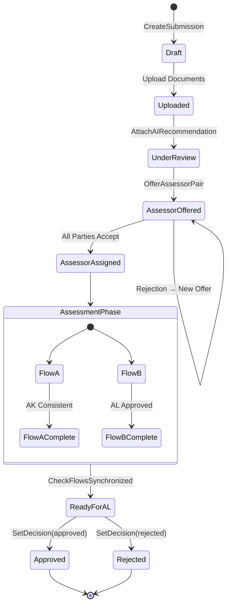
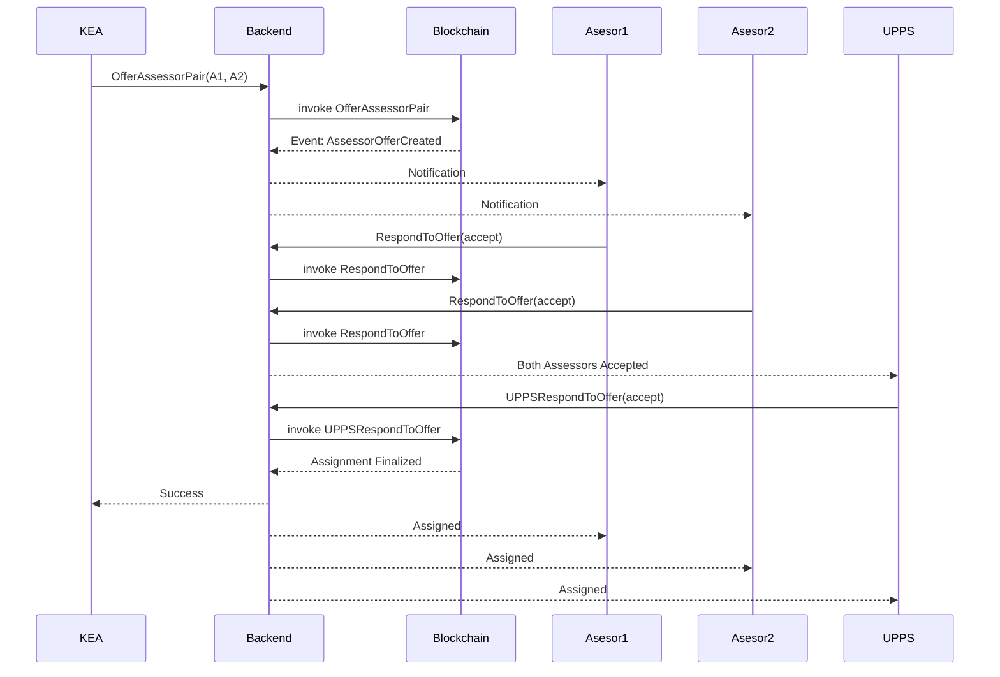
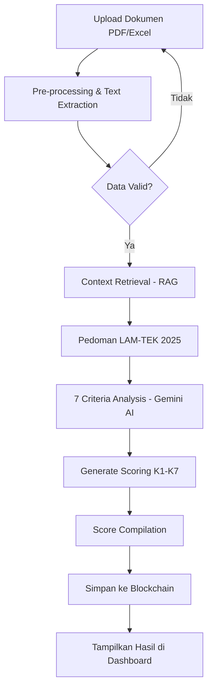

# BAB III
# METODOLOGI PENELITIAN DAN PERANCANGAN SISTEM

## 3.1 Pendekatan Penelitian

Penelitian ini mengadopsi pendekatan *Design Science Research* (DSR) sebagai kerangka metodologis utama. DSR dipilih karena relevansinya yang tinggi dalam bidang sistem informasi dan ilmu komputer, khususnya untuk penelitian yang bertujuan menghasilkan artefak inovatif—dalam hal ini, sistem akreditasi berbasis blockchain—sebagai solusi atas permasalahan praktis yang teridentifikasi. Menurut Hevner et al. (2004), DSR berfokus pada pengembangan dan evaluasi artefak IT yang dirancang untuk memecahkan masalah organisasi yang spesifik.

Proses penelitian dilaksanakan melalui tahapan iteratif yang meliputi: (1) **Identifikasi Masalah dan Motivasi**, yakni menganalisis inefisiensi dan isu trust pada proses akreditasi konvensional; (2) **Penetapan Tujuan Solusi**, yaitu merancang sistem yang menjamin transparansi (*transparency*), ketidakubahandata (*immutability*), dan efisiensi melalui otomasi cerdas; (3) **Perancangan dan Pengembangan**, yang mencakup desain arsitektur *distributed ledger* dan pengembangan algoritma *smart contract*; (4) **Demonstrasi**, di mana purwarupa sistem diuji dalam lingkungan simulasi; serta (5) **Evaluasi**, untuk mengukur kinerja dan kesesuaian sistem terhadap kebutuhan akreditasi LAM-TEK.

## 3.2 Gambaran Umum Sistem AkreChain

**AkreChain** (*Accreditation Chain*) dirancang sebagai platform terdesentralisasi yang mengintegrasikan teknologi *permissioned blockchain* dengan kecerdasan buatan (AI) untuk mengelola siklus hidup akreditasi program studi. Berbeda dengan sistem konvensional yang bersifat tersentralisasi (client-server tradisional), AkreChain mendistribusikan otoritas data ke dalam jaringan *peer-to-peer* yang aman.

Sistem ini memfasilitasi interaksi antara **lima entitas organisasi** dalam ekosistem akreditasi LAM-TEK:
1. **UPPS** (Unit Pengelola Program Studi) - Pengaju akreditasi, menyediakan dokumen LED dan LKPS
2. **Sekretariat** - Administrator yang memverifikasi kelengkapan dokumen, mengelola aspek administratif, dan menyetujui jadwal
3. **KEA** (Komite Evaluasi Akreditasi) - Menetapkan pasangan asesor dan memvalidasi konsistensi penilaian
4. **Asesor** - Tenaga ahli yang melakukan penilaian AK (Asesmen Kecukupan) dan AL (Asesmen Lapangan)
5. **Majelis Akreditasi** - Pengambil keputusan akhir untuk penetapan peringkat akreditasi

Seluruh metadata transaksi dan status akreditasi disimpan secara permanen di dalam *ledger* blockchain, sementara dokumen fisik (file PDF/Excel) disimpan dalam jaringan penyimpanan terdesentralisasi (IPFS) untuk efisiensi penyimpanan (*off-chain storage*). Komponen AI diintegrasikan untuk memberikan pra-evaluasi otomatis terhadap kelengkapan dan substansi dokumen, mereduksi beban kerja verifikasi manual.

## 3.3 Arsitektur Sistem

Arsitektur AkreChain dibangun menggunakan pendekatan *Layered Architecture* (Arsitektur Berlapis) untuk menjamin modularitas, skalabilitas, dan keamanan. Berdasarkan implementasi sistem yang berjalan, arsitektur terdiri dari **6 lapisan** yang saling terintegrasi.


*Gambar 3.1 Arsitektur Sistem AkreChain (6 Layer)*

Berdasarkan Gambar 3.1, arsitektur sistem terdiri dari:

### Layer 1 - Pengguna (User Layer)
Lima aktor utama yang mengakses sistem melalui web browser:
- **UPPS** (Unit Pengelola Program Studi) - Pengaju akreditasi
- **Sekretariat** - Verifikasi dokumen & penjadwalan
- **KEA** (Komisi Evaluasi Akreditasi) - Penetapan asesor
- **Asesor** - Assessors/Evaluators
- **Majelis Akreditasi** - Final decision board

### Layer 2 - Antarmuka Web (Presentation Layer)
Dibangun menggunakan **React + Vite** dengan komponen frontend:
- Dashboard (per role)
- Upload Dokumen (LED, LKPS)
- Status Akreditasi
- Penilaian Asesor
- Scheduling AL/AD
- Manajemen Batch
- Laporan & Export

### Layer 3 - Backend Services (Business Logic Layer)
**Node.js + Express** sebagai central server dengan service-service:
- **AuthService** (JWT + RBAC) - Otentikasi dan otorisasi
- **ScoringService** (LAM-TEK 2025 - 7 Kriteria) - Kalkulasi skor
- **FabricService** - Integrasi blockchain
- **PinataService** - IPFS storage
- **SchedulingService** - Penjadwalan AL
- **ConsistencyService** - Verifikasi skor

### Layer 4 - Penyimpanan Data (Storage Layer)
- **PostgreSQL** - User data, submissions (off-chain)
- **IPFS (Pinata)** - Document storage (off-chain)
- **Hyperledger Fabric** - Blockchain records (on-chain)
- **CouchDB** - World state database

### Layer 5 - Layanan Eksternal (External Services)
- **Google Gemini AI** - Document analysis & scoring
- **Fabric CA** - Certificate Authority untuk identitas digital

### Layer 6 - Output
- AI Scoring Results (7 Kriteria)
- Consistency Reports
- Accreditation Certificates
- Export: CSV, Excel, PDF
- Blockchain Verification

**Alur Data:** Pengguna → Web → Backend → Blockchain/AI → Output → External API

---

### Arsitektur Sederhana (Simplified Architecture)


*Gambar 3.2 Arsitektur Sistem Sederhana - Alur Komponen Utama*

Gambar 3.2 menunjukkan alur komponen utama secara sederhana:
1. **User (UPPS/Sekretariat/Asesor/KEA/Majelis)** mengakses sistem
2. **Frontend** (React + Vite) sebagai antarmuka
3. **API Backend** (Express.js) sebagai orchestrator
4. **Generative AI** (Google Gemini) untuk analisis dokumen
5. **IPFS** untuk penyimpanan dokumen
6. **PostgreSQL** untuk data relasional
7. **Smart Contract** untuk logika bisnis blockchain
8. **Blockchain** (Hyperledger Fabric) untuk immutable records
9. **CouchDB** untuk world state queries

## 3.4 Perancangan Infrastruktur Blockchain

Infrastruktur jaringan blockchain AkreChain dirancang menggunakan platform **Hyperledger Fabric v2.5.12**. Pemilihan Fabric didasarkan pada arsitekturnya yang modular dan fitur privasi (*channel*) yang sesuai dengan proses akreditasi yang membutuhkan kerahasiaan data antar institusi namun transparan bagi asesor dan sekretariat.


*Gambar 3.3 Topologi Jaringan Blockchain AkreChain*

Topologi jaringan terdiri dari komponen-komponen berikut:

*   **Organizations (Organisasi)**: Arsitektur jaringan terdiri dari **5 organisasi otonom** yang merepresentasikan stakeholder dalam ekosistem akreditasi LAM-TEK:

    | No | Organisasi | Nama Lengkap | MSP ID | Port CouchDB |
    |----|------------|--------------|--------|--------------|
    | 1 | **UPPS** | Unit Pengelola Program Studi | UPPSMSP | 5100 |
    | 2 | **Sekretariat** | Sekretariat LAM-TEK | SekadminMSP | 5120 |
    | 3 | **KEA** | Komisi Evaluasi Akreditasi | KEAMSP | 5160 |
    | 4 | **Asesor** | Assessor/Evaluator | AsesorMSP | 5180 |
    | 5 | **Majelis** | Majelis Akreditasi | MajelisMSP | 5200 |

*   **Peers**: Setiap organisasi mengelola minimal satu *Peer Node* (peer0) yang menyimpan salinan *ledger* dan mengeksekusi *chaincode*. Peer menggunakan **CouchDB** sebagai *state database* untuk mendukung *rich query*.

*   **Ordering Service**: Menggunakan mekanisme konsensus **Solo** (untuk development) yang dapat ditingkatkan ke **Raft** (etcdRaft) untuk production, bertanggung jawab untuk mengurutkan transaksi dan membentuk blok.

*   **Channel**: Dibuat sebuah *channel* bernama `akreditasi` yang menghubungkan seluruh 5 organisasi, mengisolasi transaksi akreditasi sehingga hanya pihak yang berwenang dalam channel tersebut yang dapat mengakses data.

*   **Chaincode**: Smart contract `submission-contract` di-deploy pada channel `akreditasi` dengan endorsement policy:
    ```
    OR('UPPSMSP.member', 'SekadminMSP.member', 'KEAMSP.member', 'AsesorMSP.member', 'MajelisMSP.member')
    ```

*   **Certificate Authority (CA)**: Setiap organisasi memiliki CA masing-masing yang mengelola identitas digital (X.509 certificates) untuk setiap entitas (user, peer, orderer), menjamin otentikasi yang kuat dalam jaringan (*Permissioned Network*).

## 3.5 Analisis dan Perancangan Smart Contract

Logika bisnis inti ditanamkan ke dalam blockchain dalam bentuk *Smart Contract* (Chaincode) yang ditulis menggunakan bahasa **TypeScript** dengan framework `fabric-contract-api`. Berbeda dengan *Smart Contract* sederhana yang hanya mencatat *hash*, AkreChain mengimplementasikan logika orkestrasi proses bisnis yang kompleks (*Complex Business Process Orchestration*).

### 3.5.1 Struktur Data Ledger

Data disimpan dalam struktur JSON `Submission` yang komprehensif dengan skema sebagai berikut:

```typescript
interface Submission {
    // Metadata Utama
    submissionId: string;           // ID unik pengajuan
    programStudi: string;           // Nama program studi
    institusi: string;              // Nama institusi
    programType?: string;           // Jenis program (S1, S2, D3, dll)
    
    // Dokumen & Status
    documents: Document[];          // Array dokumen (CID IPFS + hash)
    status: 'draft' | 'uploaded' | 'processing' | 'under_review' | 'approved' | 'rejected';
    version: number;                // Versi revisi dokumen
    
    // Analisis AI
    ai?: AIRecommendation;          // Hasil analisis AI (skor, rekomendasi)
    
    // Penugasan Asesor (Fase 3A)
    currentOffer?: AssessorOffer;   // Penawaran asesor aktif
    offerHistory?: AssessorOffer[]; // Riwayat penawaran
    assignedAssessors?: {           // Asesor yang ditugaskan
        assessor1Id, assessor1Name,
        assessor2Id, assessor2Name,
        assignedAt
    };
    
    // Asesmen Kecukupan (AK)
    akAssessments?: AKAssessment[]; // Penilaian AK dari kedua asesor
    akConsistent?: boolean;         // Status konsistensi nilai AK
    
    // Penjadwalan Asesmen Lapangan (AL) - Fase 3B
    alSchedule?: ALSchedule;        // Jadwal AL aktif
    alScheduleHistory?: ALSchedule[];
    
    // Sinkronisasi Alur Paralel
    flowSyncStatus?: FlowSyncStatus; // Status sinkronisasi Flow A & B
    
    // Keputusan Akhir
    decision?: Decision;            // Keputusan approval/rejection
    
    // Audit Trail
    createdAt: string;
    updatedAt: string;
    submittedBy: string;
    submittedByMsp: string;
}
```

### 3.5.2 Mekanisme Access Control (MSP-Based)

Setiap fungsi chaincode dilindungi oleh validasi MSP (*Membership Service Provider*) yang memastikan hanya organisasi yang berwenang yang dapat mengeksekusi fungsi tertentu:

```typescript
private assertMSP(ctx: Context, allowedMSPs: string[], action: string) {
    const mspId = ctx.clientIdentity.getMSPID();
    if (!allowedMSPs.includes(mspId)) {
        throw new Error(`Access denied for ${action}. Required MSPs: ${allowedMSPs.join(', ')}`);
    }
    return mspId;
}
```

### 3.5.3 Fungsi-Fungsi Utama Chaincode

Kontrak cerdas menyediakan 16 fungsi transaksional yang terbagi dalam 4 fase utama:

#### **Fase 1: Inisiasi dan Pengajuan**

| Fungsi | MSP yang Diizinkan | Deskripsi |
|--------|-------------------|-----------|
| `CreateSubmission` | UPPS, Sekretariat | Membuat record pengajuan baru di ledger |
| `AttachAIRecommendation` | UPPS, Sekretariat | Menautkan hasil analisis AI ke submission |
| `UpdateDocuments` | UPPS, Sekretariat | Update dokumen untuk siklus revisi |

#### **Fase 2: Penugasan Asesor (Three-Way Handshake)**

| Fungsi | MSP yang Diizinkan | Deskripsi |
|--------|-------------------|-----------|
| `OfferAssessorPair` | KEA, Sekretariat | KEA menawarkan pasangan asesor |
| `RespondToOffer` | Asesor | Asesor menerima/menolak penugasan |
| `UPPSRespondToOffer` | UPPS | UPPS menyetujui/menolak pasangan asesor |

#### **Fase 3A: Asesmen Kecukupan (AK) - Flow A**

| Fungsi | MSP yang Diizinkan | Deskripsi |
|--------|-------------------|-----------|
| `SubmitAKAssessment` | Asesor | Asesor submit nilai AK per kriteria |
| `CheckAKConsistency` | KEA, Sekretariat | Validasi konsistensi nilai antar asesor |

#### **Fase 3B: Penjadwalan AL - Flow B (Paralel dengan Flow A)**

| Fungsi | MSP yang Diizinkan | Deskripsi |
|--------|-------------------|-----------|
| `ProposeALSchedule` | KEA, Sekretariat | Mengusulkan jadwal dan venue AL |
| `ApproveALSchedule` | Sekretariat | Menyetujui/menolak jadwal AL |

#### **Fase 4: Sinkronisasi dan Finalisasi**

| Fungsi | MSP yang Diizinkan | Deskripsi |
|--------|-------------------|-----------|
| `CheckFlowsSynchronized` | KEA, Sekretariat | Parallel Gateway - cek kedua flow selesai |
| `SetDecision` | Sekretariat, KEA, Asesor, Majelis | Penetapan keputusan akhir |
| `SetScoringResult` | Asesor, Sekretariat, KEA | Menyimpan hasil skoring final |

### 3.5.4 Mekanisme Parallel Gateway (Flow Synchronization)

Salah satu fitur penting dalam smart contract adalah **Parallel Gateway** yang memastikan dua alur proses (Flow A dan Flow B) berjalan secara paralel dan tersinkronisasi sebelum melanjutkan ke tahap berikutnya:

```typescript
interface FlowSyncStatus {
    flowACompleted: boolean;    // AK Assessment consistent
    flowACompletedAt?: string;
    flowBCompleted: boolean;    // AL Schedule approved  
    flowBCompletedAt?: string;
    syncCompleted: boolean;     // Both flows finished
    syncCompletedAt?: string;
    readyForAL: boolean;        // Ready for field assessment
}
```

Fungsi `CheckFlowsSynchronized` bertindak sebagai *Logic Gate*:
- Memverifikasi Flow A: Skor AK telah konsisten antar asesor (`akConsistent === true`)
- Memverifikasi Flow B: Jadwal AL telah disetujui (`alSchedule.status === 'approved'`)
- Jika kedua kondisi terpenuhi, sistem berpindah ke status `readyForAL = true`

Pendekatan ini menjamin **integritas alur kerja** (*workflow integrity*), di mana tidak ada tahapan yang dapat dilompati secara ilegal.

### 3.5.5 Event-Driven Architecture

Smart contract mengimplementasikan arsitektur berbasis event untuk notifikasi real-time ke sistem off-chain:

| Event | Trigger | Data yang Dikirim |
|-------|---------|-------------------|
| `SubmissionCreated` | CreateSubmission | submissionId, programStudi, institusi, timestamp |
| `AIRecommendationAttached` | AttachAIRecommendation | submissionId, score, timestamp |
| `AssessorOfferCreated` | OfferAssessorPair | submissionId, offerId, assessor1Id, assessor2Id |
| `AssessorResponded` | RespondToOffer | submissionId, assessorId, response |
| `AKAssessmentSubmitted` | SubmitAKAssessment | submissionId, assessorId, timestamp |
| `ALScheduleProposed` | ProposeALSchedule | submissionId, scheduleId, proposedDate |
| `ALScheduleApproved` | ApproveALSchedule | submissionId, approved, approvedBy |
| `FlowsSynchronized` | CheckFlowsSynchronized | submissionId, flowACompletedAt, flowBCompletedAt |
| `SubmissionDecided` | SetDecision | submissionId, status, timestamp |

## 3.6 Alur Kerja Sistem dan Interaksi Komponen

Alur kerja AkreChain dirancang untuk meminimalkan *bottleneck* administratif melalui otomatisasi. Interaksi antar komponen dapat dijelaskan melalui skenario *Sequence* yang menghubungkan aktor manusia, sistem *off-chain*, dan jaringan blockchain.

### 3.6.1 Diagram Alur Subsistem

Sistem AkreChain terdiri dari beberapa subsistem yang saling terintegrasi:

```
┌─────────────────────────────────────────────────────────────────────────────┐
│                          PRESENTATION LAYER                                  │
│  ┌─────────────┐  ┌─────────────┐  ┌─────────────┐  ┌─────────────┐         │
│  │ Dashboard   │  │ Submission  │  │ Assessment  │  │ Scheduling  │         │
│  │ UPPS        │  │ Management  │  │ Module      │  │ Module      │         │
│  └──────┬──────┘  └──────┬──────┘  └──────┬──────┘  └──────┬──────┘         │
│         │                │                │                │                 │
│         └────────────────┴────────────────┴────────────────┘                 │
│                                   │                                          │
│                          React + Vite Frontend                               │
└───────────────────────────────────┬─────────────────────────────────────────┘
                                    │ REST API / WebSocket
┌───────────────────────────────────┼─────────────────────────────────────────┐
│                    BUSINESS LOGIC LAYER (Off-Chain)                         │
│  ┌────────────────────────────────┼────────────────────────────────────┐    │
│  │              Express.js API Gateway (Node.js)                       │    │
│  │  ┌──────────────┐  ┌──────────────┐  ┌──────────────┐              │    │
│  │  │ Auth Module  │  │ Submission   │  │ Assessment   │              │    │
│  │  │ (JWT/MSP)    │  │ Controller   │  │ Controller   │              │    │
│  │  └──────────────┘  └──────────────┘  └──────────────┘              │    │
│  └────────────────────────────────┬────────────────────────────────────┘    │
│                                   │                                          │
│  ┌────────────────┐  ┌────────────┴───────────┐  ┌─────────────────┐        │
│  │ Gemini AI      │  │ Hyperledger Fabric SDK │  │ IPFS Gateway    │        │
│  │ Service        │  │ (fabric-network)       │  │ (Pinata)        │        │
│  └────────────────┘  └────────────────────────┘  └─────────────────┘        │
└───────────────────────────────────┬─────────────────────────────────────────┘
                                    │
┌───────────────────────────────────┼─────────────────────────────────────────┐
│                    BLOCKCHAIN & STORAGE LAYER (On-Chain)                     │
│                                   │                                          │
│  ┌────────────────────────────────┴────────────────────────────────────┐    │
│  │                    Channel: akreditasi                               │    │
│  │  ┌──────────────────────────────────────────────────────────────┐   │    │
│  │  │              Chaincode: submission-contract                   │   │    │
│  │  │  • CreateSubmission      • SubmitAKAssessment                │   │    │
│  │  │  • AttachAIRecommendation • ProposeALSchedule                │   │    │
│  │  │  • OfferAssessorPair     • ApproveALSchedule                 │   │    │
│  │  │  • RespondToOffer        • CheckFlowsSynchronized            │   │    │
│  │  │  • SetDecision           • QuerySubmission                   │   │    │
│  │  └──────────────────────────────────────────────────────────────┘   │    │
│  └─────────────────────────────────────────────────────────────────────┘    │
│                                                                              │
│  ┌─────────┐  ┌─────────┐  ┌─────────┐  ┌─────────┐  ┌─────────┐           │
│  │  UPPS   │  │Sekretariat│ │   KEA   │  │ Asesor  │  │ Majelis │           │
│  │  Peer0  │  │  Peer0  │  │  Peer0  │  │  Peer0  │  │  Peer0  │           │
│  │ CouchDB │  │ CouchDB │  │ CouchDB │  │ CouchDB │  │ CouchDB │           │
│  │  5100   │  │  5120   │  │  5160   │  │  5180   │  │  5200   │           │
│  └─────────┘  └─────────┘  └─────────┘  └─────────┘  └─────────┘           │
│                                                                              │
│                    ┌──────────────────────────┐                             │
│                    │    Ordering Service      │                             │
│                    │    (Solo/Raft)           │                             │
│                    └──────────────────────────┘                             │
└──────────────────────────────────────────────────────────────────────────────┘
```

### 3.6.2 Sequence Diagram: Proses Pengajuan dan Analisis AI

```
┌──────┐     ┌──────────┐     ┌─────────┐     ┌──────┐     ┌───────────┐
│ UPPS │     │ Frontend │     │ Backend │     │ IPFS │     │ Blockchain│
└──┬───┘     └────┬─────┘     └────┬────┘     └──┬───┘     └─────┬─────┘
   │              │                │             │               │
   │ Upload LED/LKPS              │             │               │
   │──────────────>               │             │               │
   │              │ POST /api/submissions       │               │
   │              │───────────────>             │               │
   │              │                │ Store PDF  │               │
   │              │                │────────────>               │
   │              │                │    CID     │               │
   │              │                │<───────────│               │
   │              │                │             │               │
   │              │                │ Extract Text + Analyze     │
   │              │                │──────────────────┐         │
   │              │                │ (Gemini AI)      │         │
   │              │                │<─────────────────┘         │
   │              │                │             │               │
   │              │                │ CreateSubmission(metadata+CID+AI)
   │              │                │─────────────────────────────>
   │              │                │             │    Event:     │
   │              │                │             │ SubmissionCreated
   │              │                │<────────────────────────────│
   │              │ 201 Created    │             │               │
   │              │<───────────────│             │               │
   │ Success      │                │             │               │
   │<─────────────│                │             │               │
```

### 3.6.3 Sequence Diagram: Three-Way Handshake Penugasan Asesor

```
┌──────┐  ┌─────┐  ┌────────────┐  ┌─────────┐  ┌───────────┐
│  KEA │  │UPPS │  │ Asesor 1&2 │  │ Backend │  │ Blockchain│
└──┬───┘  └──┬──┘  └─────┬──────┘  └────┬────┘  └─────┬─────┘
   │         │           │              │             │
   │ OfferAssessorPair(assessor1, assessor2)         │
   │────────────────────────────────────>             │
   │         │           │              │────────────>│
   │         │           │              │ Event:      │
   │         │           │              │ AssessorOfferCreated
   │         │           │<─────────────│             │
   │         │           │ Notif: Penugasan Baru     │
   │         │           │              │             │
   │         │           │ RespondToOffer(accept)    │
   │         │           │─────────────>│             │
   │         │           │              │────────────>│
   │         │           │              │             │
   │         │ Notif: Asesor Accepted   │             │
   │         │<─────────────────────────│             │
   │         │           │              │             │
   │         │ UPPSRespondToOffer(accept)            │
   │         │─────────────────────────>│             │
   │         │           │              │────────────>│
   │         │           │              │             │
   │         │           │     Assignment Finalized  │
   │<────────│<──────────│<─────────────│<────────────│
```

### 3.6.4 Diagram Alur Paralel: Flow A (AK) dan Flow B (AL Scheduling)

```
                        ┌─────────────────────┐
                        │  Asesor Assigned    │
                        └──────────┬──────────┘
                                   │
                    ┌──────────────┴──────────────┐
                    │      Parallel Gateway       │
                    │         (Fork)              │
                    └──────────────┬──────────────┘
                                   │
              ┌────────────────────┼────────────────────┐
              │                    │                    │
              ▼                    │                    ▼
    ┌─────────────────┐            │          ┌─────────────────┐
    │    FLOW A       │            │          │    FLOW B       │
    │ Asesmen Kecukupan│           │          │ AL Scheduling   │
    └────────┬────────┘            │          └────────┬────────┘
             │                     │                   │
    ┌────────▼────────┐            │          ┌────────▼────────┐
    │ Asesor 1 Submit │            │          │ KEA Propose     │
    │ AK Assessment   │            │          │ AL Schedule     │
    └────────┬────────┘            │          └────────┬────────┘
             │                     │                   │
    ┌────────▼────────┐            │          ┌────────▼────────┐
    │ Asesor 2 Submit │            │          │ Sekretariat     │
    │ AK Assessment   │            │          │ Approve Schedule│
    └────────┬────────┘            │          └────────┬────────┘
             │                     │                   │
    ┌────────▼────────┐            │          ┌────────▼────────┐
    │ KEA Check       │            │          │ flowBCompleted  │
    │ Consistency     │            │          │ = true          │
    └────────┬────────┘            │          └────────┬────────┘
             │                     │                   │
    ┌────────▼────────┐            │                   │
    │ flowACompleted  │            │                   │
    │ = true          │            │                   │
    └────────┬────────┘            │                   │
             │                     │                   │
             └─────────────────────┼───────────────────┘
                                   │
                    ┌──────────────▼──────────────┐
                    │      Parallel Gateway       │
                    │         (Join)              │
                    │  CheckFlowsSynchronized()   │
                    └──────────────┬──────────────┘
                                   │
                        ┌──────────▼──────────┐
                        │   readyForAL = true │
                        │   Proceed to AL     │
                        └─────────────────────┘
```

### 3.6.5 Analisis Mekanisme On-Chain dan Off-Chain

Untuk mengatasi batasan skalabilitas dan biaya penyimpanan pada blockchain, sistem menerapkan pola *Hybrid Storage Architecture* dengan pemisahan yang jelas antara data on-chain dan off-chain.

#### **1. Data On-Chain (Disimpan di Ledger Hyperledger Fabric)**

Data yang disimpan secara *on-chain* adalah data yang membutuhkan **integritas tinggi**, **auditabilitas**, dan menjadi **dasar pengambilan keputusan** (konsensus).

| Kategori | Data yang Disimpan | Alasan |
|----------|-------------------|--------|
| **Identitas & Akses** | User ID, MSP ID, Role, Signature | Otentikasi & otorisasi |
| **Metadata Bisnis** | submissionId, programStudi, institusi, status, version | Tracking state |
| **Bukti Integritas** | CID IPFS (hash dokumen), hash analisis AI | Tamper-proof verification |
| **Hasil Penilaian** | AK scores, consistency status, decision | Immutable audit trail |
| **State Machine** | flowSyncStatus, currentOffer, assignedAssessors | Workflow orchestration |
| **Timestamps** | createdAt, updatedAt, decidedAt | Kronologi legal |

**Karakteristik Data On-Chain:**
- Ukuran kecil (< 1 MB per transaksi)
- Memerlukan konsensus antar organisasi
- Bersifat permanen (*immutable*)
- Dapat di-query menggunakan CouchDB rich queries

#### **2. Data Off-Chain (Disimpan di IPFS & Database Lokal)**

Data yang bersifat **statis**, **berukuran besar**, atau **data sementara** yang tidak memerlukan konsensus blockchain.

| Lokasi Penyimpanan | Data | Ukuran Tipikal |
|-------------------|------|----------------|
| **IPFS (Pinata)** | Dokumen LED (PDF) | 5-50 MB |
| **IPFS (Pinata)** | Dokumen LKPS (Excel/PDF) | 1-10 MB |
| **PostgreSQL (Backend)** | Detail user, session, cache | Variable |
| **PostgreSQL (Backend)** | Hasil analisis AI mentah | 10-100 KB |
| **File System** | Logs, temporary files | Variable |

**Mekanisme Linking On-Chain ↔ Off-Chain:**

```
┌─────────────────────────────────────────────────────────────────┐
│                         IPFS Network                             │
│  ┌─────────────────────────────────────────────────────────┐    │
│  │  LED.pdf  ────────────────────────────────────────────  │    │
│  │  CID: QmX7b8Jp3xK9LmNpQr2sT4vWxYz1A2bC3dE4fG5hI6jK7l   │    │
│  └─────────────────────────────────────────────────────────┘    │
└─────────────────────────────────────────────────────────────────┘
                              │
                              │ Hash Pointer (CID)
                              ▼
┌─────────────────────────────────────────────────────────────────┐
│                    Hyperledger Fabric Ledger                     │
│  ┌─────────────────────────────────────────────────────────┐    │
│  │  {                                                       │    │
│  │    "submissionId": "SUB-2026-001",                      │    │
│  │    "documents": [                                        │    │
│  │      {                                                   │    │
│  │        "type": "LED",                                    │    │
│  │        "cid": "QmX7b8Jp3xK9LmNpQr2sT4vWxYz1A2bC3dE4fG5h",│    │
│  │        "hash": "sha256:a1b2c3d4e5f6...",                 │    │
│  │        "verified": true                                  │    │
│  │      }                                                   │    │
│  │    ],                                                    │    │
│  │    "ai": { "scoreCompleteness": 85, ... }               │    │
│  │  }                                                       │    │
│  └─────────────────────────────────────────────────────────┘    │
└─────────────────────────────────────────────────────────────────┘
```

#### **3. Keuntungan Arsitektur Hybrid**

| Aspek | Manfaat |
|-------|---------|
| **Skalabilitas** | Ledger tetap ringan, tidak membengkak dengan file besar |
| **Throughput** | Transaksi cepat karena payload minimal |
| **Integritas** | Hash di blockchain menjamin file IPFS tidak dimodifikasi |
| **Biaya** | Penyimpanan IPFS lebih murah dibanding on-chain |
| **Privasi** | File bisa dienkripsi off-chain, hanya hash yang publik |

Pemisahan ini memastikan bahwa jaringan blockchain tetap ringan dan cepat (*high throughput*), sementara integritas data dokumen tetap terjamin secara matematis melalui fungsi *hashing* SHA-256 yang ditautkan ke ledger.


## 3.7 Perancangan Modul Cerdas (AI Integration)

Salah satu kebaruan (novelty) dalam AkreChain adalah integrasi modul kecerdasan buatan untuk membantu proses asesmen. Modul ini menggunakan *Large Language Model* (LLM) **Google Gemini** yang diakses melalui API dengan pendekatan **RAG (Retrieval-Augmented Generation)**.


*Gambar 3.4 Alur Kerja Prototipe AI - AkreChain*

Berdasarkan Gambar 3.4, alur kerja modul AI terdiri dari 4 layer:

### Layer 1 - Pengguna (UPPS Admin)
- **Upload Dokumen**: User mengunggah file PDF (LED) dan Excel (LKPS)
- **Lihat Skor Per Kriteria**: Hasil akhir ditampilkan dalam dashboard

### Layer 2 - Sistem (Orchestrator)
- **Pre-processing**: Ekstraksi teks dari PDF/Excel
- **Rule-Based Validation**: Validasi format dan kelengkapan data
- **Data Valid?**: Decision point - jika tidak valid, kembali ke user untuk perbaikan
- **Score Compilation**: Kompilasi hasil skor dari AI

### Layer 3 - AI Engine (Google Gemini + RAG)
- **Context Retrieval (RAG)**: Mengambil konteks dari Pedoman LAM-TEK 2025
- **7 Criteria Analysis**: Analisis dokumen berdasarkan 7 kriteria akreditasi
- **Generate Scoring**: Menghasilkan skor per kriteria (K1-K7) dengan nilai numerik

### Layer 4 - Blockchain (Hyperledger Fabric)
- **Simpan Metadata dan Skor**: Hash hasil analisis disimpan ke ledger
- **Immutable Record**: Metadata & skor tercatat secara permanen

**Alur Data:** Dokumen (PDF/Excel) → Ekstraksi Teks → Validasi Rules → Analisis AI (RAG) → Skor Final → Blockchain Ledger

### Mekanisme RAG (Retrieval-Augmented Generation)

Sistem menggunakan pendekatan RAG untuk meningkatkan akurasi penilaian:

| Komponen | Deskripsi |
|----------|----------|
| **Knowledge Base** | Pedoman Penilaian LAM-TEK 2025 (7 Kriteria, 50+ Indikator) |
| **Retrieval** | Mencari indikator relevan berdasarkan konten dokumen |
| **Augmentation** | Menggabungkan konteks pedoman dengan teks dokumen |
| **Generation** | Gemini AI menghasilkan skor dan rekomendasi |

### Output AI Scoring

```json
{
  "scoring_summary": {
    "K1": { "score": 85, "max": 100, "indicators": [...] },
    "K2": { "score": 90, "max": 100, "indicators": [...] },
    "K3": { "score": 85, "max": 100, "indicators": [...] },
    "K4": { "score": 90, "max": 100, "indicators": [...] },
    "K5": { "score": 85, "max": 100, "indicators": [...] },
    "K6": { "score": 90, "max": 100, "indicators": [...] },
    "K7": { "score": 88, "max": 100, "indicators": [...] },
    "total_score": 613,
    "overall_percentage": 87.57
  },
  "recommendations": [...],
  "flags": [...]
}
```

## 3.8 Justifikasi Teknis dan Keamanan

Pemilihan teknologi dan desain arsitektur didasarkan pada analisis kebutuhan non-fungsional sistem yang kritikal:

1.  **Integritas Data (Data Integrity)**: Penggunaan *hash chain* pada Hyperledger Fabric menjamin bahwa sejarah data akreditasi tidak dapat dimanipulasi (*tamper-proof*). Hal ini menjawab masalah potensi kecurangan atau perubahan data pasca-asesmen.
2.  **Ketersediaan Data (Availability)**: Penyimpanan dokumen di IPFS (Pinata) mendistribusikan data secara redundan, mencegah *Single Point of Failure* yang sering terjadi pada server penyimpanan terpusat.
3.  **Privasi (Privacy)**: Implementasi *Private Data Collections* (PDC) atau mekanisme *Channel* pada Fabric memungkinkan data sensitif hanya dapat dibuka oleh pihak yang berkepentingan, sesuai dengan etika kerahasiaan data institusi.
4.  **Skalabilitas (Scalability)**: Arsitektur *off-chain* (menyimpan hash saja di blockchain, data asli di IPFS) adalah strategi *best-practice* untuk mengatasi batasan ukuran blok dan throughput transaksi pada sistem blockchain, memastikan sistem tetap responsif meski volume dokumen meningkat.

## 3.9 Rancangan Visual dan Prompt Diagram

Bagian ini menyediakan spesifikasi deskriptif (prompt) yang digunakan untuk menghasilkan representasi visual dari arsitektur sistem. Prompt ini dirancang untuk diolah oleh generator diagram berbasis AI atau digambar manual oleh desainer.

### Tools yang Direkomendasikan untuk Generate Diagram

| Kategori | Tools | Kegunaan |
|----------|-------|----------|
| **AI Image Generator** | DALL-E 3, Midjourney, Leonardo AI | Diagram arsitektur bergaya modern |
| **Diagram Tools** | draw.io, Lucidchart, Miro | Diagram teknis profesional |
| **Code-based** | Mermaid.js, PlantUML, D2 | Diagram dari kode (version control friendly) |
| **Design** | Figma, Canva | Infografis dan presentasi |
| **Sketching** | Excalidraw, tldraw | Diagram sketsa cepat |

### Daftar Gambar yang Tersedia

| No | Nama File | Deskripsi | Referensi |
|----|-----------|-----------|----------|
| 1 | `Arsitektur Sistem.png` | Arsitektur 6-layer sistem AkreChain | Gambar 3.1 |
| 2 | `arsitektur.png` | Arsitektur sederhana (komponen utama) | Gambar 3.2 |
| 3 | `Arsitektur Jaringan Blockchain.png` | Topologi jaringan 5 organisasi | Gambar 3.3 |
| 4 | `Prototype AI.png` | Alur kerja AI dengan RAG | Gambar 3.4 |

---

### 3.9.1 Prompt untuk Diagram Arsitektur Jaringan Blockchain

> **Prompt (Bahasa Indonesia):**
> "Buat diagram arsitektur jaringan blockchain untuk Sistem Akreditasi AkreChain dengan gaya modern dan profesional.
> 
> **Komponen Utama:**
> - Channel bernama 'akreditasi' di tengah sebagai penghubung
> - Chaincode 'submission-contract' di dalam channel
> - Orderer MSP (Solo Consensus) di bagian atas
> 
> **5 Organisasi (dalam bentuk hexagon berwarna berbeda):**
> 1. UPPS (biru) - Full name: Unit Pengelola Program Studi, MSP: UPPSMSP, CouchDB port 5100
> 2. Sekretariat (oranye) - Full name: Sekretariat LAM-TEK, MSP: SekadminMSP, CouchDB port 5120
> 3. KEA (ungu) - Full name: Komisi Evaluasi Akreditasi, MSP: KEAMSP, CouchDB port 5160
> 4. Asesor (hijau teal) - Full name: Assessor/Evaluator, MSP: AsesorMSP, CouchDB port 5180
> 5. Majelis (merah) - Full name: Majelis Akreditasi, MSP: MajelisMSP, CouchDB port 5200
> 
> **Setiap organisasi memiliki:**
> - Peer0 node (ikon jaringan)
> - CouchDB (ikon database)
> - CA/Certificate Authority (ikon gembok)
> 
> **Footer:** Tampilkan teknologi: Hyperledger Fabric 2.5.12, Node.js Chaincode, CouchDB State Database, Docker + Fablo
> 
> **Endorsement Policy:** OR('UPPSMSP.member', 'SekadminMSP.member', 'KEAMSP.member', 'AsesorMSP.member', 'MajelisMSP.member')
> 
> **Gaya visual:** Flat design, warna biru navy sebagai latar belakang header, isometric perspective untuk nodes"

---

> **Prompt (English):**
> "Create a modern blockchain network architecture diagram for the AkreChain Accreditation System.
> 
> **Main Components:**
> - Central channel named 'akreditasi' connecting all organizations
> - Chaincode 'submission-contract' inside the channel
> - Orderer MSP (Solo Consensus) at the top
> 
> **5 Organizations (colored hexagons):**
> 1. UPPS (blue) - Unit Pengelola Program Studi, MSP: UPPSMSP
> 2. Sekretariat (orange) - Secretariat LAM-TEK, MSP: SekadminMSP  
> 3. KEA (purple) - Accreditation Evaluation Committee, MSP: KEAMSP
> 4. Asesor (teal) - Assessor/Evaluator, MSP: AsesorMSP
> 5. Majelis (red) - Accreditation Council, MSP: MajelisMSP
> 
> **Each organization has:** Peer0, CouchDB, Certificate Authority
> 
> **Style:** Professional, flat design, navy blue header, isometric perspective"

### 3.9.2 Prompt untuk Diagram Arsitektur Sistem (Layered Architecture)

> **Prompt:**
> "Create a modern layered architecture diagram for a Blockchain-based Accreditation System.
> 
> **Layers (top to bottom):**
> 1. **Presentation Layer:** React + Vite Frontend with modules (Dashboard, Submission, Assessment, Scheduling). Actors: UPPS, Sekretariat, KEA, Asesor, Majelis
> 
> 2. **Business Logic Layer (Off-Chain):**
>    - Express.js API Gateway (Node.js)
>    - Authentication Module (JWT + MSP validation)
>    - Gemini AI Service (document analysis)
>    - IPFS Gateway (Pinata for file storage)
>    - Hyperledger Fabric SDK (fabric-network)
> 
> 3. **Blockchain & Storage Layer (On-Chain):**
>    - Channel 'akreditasi' 
>    - Chaincode 'submission-contract' (TypeScript)
>    - 5 Peer nodes (UPPS, Sekretariat, KEA, Asesor, Majelis)
>    - CouchDB for World State
>    - Ordering Service (Solo/Raft)
> 
> **Visual Flow:** Show arrows from Frontend → API Gateway → (AI Service, IPFS, Fabric SDK) → Blockchain
> 
> **Color Scheme:** Professional blue gradient, white backgrounds for components
> 
> **Style:** Flat design, clean lines, technology icons"

### 3.9.3 Prompt untuk Data Flow Diagram (Hybrid Storage)

> **Prompt:**
> "Draw a data flow diagram emphasizing the 'Hybrid Storage Strategy' for AkreChain.
> 
> **Flow Steps:**
> 1. User uploads PDF document → System sends PDF to IPFS → IPFS returns CID (Content Hash)
> 2. System extracts text from PDF → Sends text to Gemini AI → AI returns Analysis Score & Recommendations
> 3. System compiles transaction: [Metadata + CID + AI Score Hash] → Sends to Blockchain Peer
> 4. Peer executes Chaincode → Ordering Service creates block → Block committed to all peers
> 
> **Visual Elements:**
> - Use document icon for PDF (label: 'Heavy Data ~10-50MB')
> - Use key/hash icon for CID
> - Use brain icon for AI
> - Use chain icon for Blockchain (label: 'Light Metadata ~1KB')
> 
> **Show clearly:**
> - Heavy data (PDF) goes to IPFS (off-chain)
> - Light metadata (hash, scores) goes to Blockchain (on-chain)
> 
> **Color coding:** Green for off-chain path, Blue for on-chain path"

### 3.9.4 Prompt untuk State Machine Diagram (Submission Lifecycle)

> **Prompt:**
> "Create a State Machine Diagram for the Accreditation Submission lifecycle in the smart contract.
> 
> **States (rectangles with rounded corners):**
> 1. **Draft** - Initial creation (gray)
> 2. **Uploaded** - Documents uploaded & hashed (light blue)
> 3. **Under_Review** - AI analysis attached (yellow)
> 4. **Assessor_Offered** - KEA proposes assessor pair (orange)
> 5. **Assessor_Assigned** - All parties accepted (green)
> 6. **Assessment_Phase** - Parallel split into:
>    - Flow A: AK_Scoring (assessors submit scores)
>    - Flow B: AL_Scheduling (schedule proposed & approved)
> 7. **Ready_For_AL** - Synchronization point reached (dark green)
> 8. **Approved/Rejected** - Final decision (green/red)
> 
> **Transitions (arrows with labels):**
> - Draft → Uploaded: 'CreateSubmission'
> - Uploaded → Under_Review: 'AttachAIRecommendation'
> - Under_Review → Assessor_Offered: 'OfferAssessorPair'
> - Assessor_Offered → Assessor_Assigned: 'All Responses Accepted'
> - Assessor_Assigned → Assessment_Phase: 'Start Assessment'
> - Assessment_Phase → Ready_For_AL: 'CheckFlowsSynchronized (both true)'
> - Ready_For_AL → Approved/Rejected: 'SetDecision'
> 
> **Style:** UML state diagram format, clear labels, professional colors"

### 3.9.5 Prompt untuk Sequence Diagram (Three-Way Handshake)

> **Prompt:**
> "Create a UML Sequence Diagram for the Three-Way Handshake Assessor Assignment process.
> 
> **Actors/Lifelines (left to right):**
> 1. KEA (initiator)
> 2. Backend API
> 3. Blockchain (chaincode)
> 4. Asesor 1
> 5. Asesor 2
> 6. UPPS
> 
> **Message Flow:**
> 1. KEA → Backend: OfferAssessorPair(assessor1, assessor2)
> 2. Backend → Blockchain: invoke OfferAssessorPair
> 3. Blockchain → Backend: Event: AssessorOfferCreated
> 4. Backend → Asesor 1 & 2: Notification (WebSocket)
> 5. Asesor 1 → Backend: RespondToOffer(accept)
> 6. Backend → Blockchain: invoke RespondToOffer
> 7. Asesor 2 → Backend: RespondToOffer(accept)
> 8. Backend → Blockchain: invoke RespondToOffer
> 9. Backend → UPPS: Notification (both assessors accepted)
> 10. UPPS → Backend: UPPSRespondToOffer(accept)
> 11. Backend → Blockchain: invoke UPPSRespondToOffer
> 12. Blockchain: Assignment Finalized → assignedAssessors populated
> 13. Blockchain → All: Event: SubmissionAssigned
> 
> **Style:** Standard UML sequence diagram with activation bars, return messages shown as dashed lines"

### 3.9.6 Prompt untuk Diagram Arsitektur Sistem 6-Layer

> **Prompt (Bahasa Indonesia):**
> "Buat diagram arsitektur sistem berlapis untuk Sistem Akreditasi AkreChain dengan 6 layer horizontal berwarna gradasi.
> 
> **Layer 1 - PENGGUNA (Ungu):**
> - 5 aktor dengan ikon: UPPS (gedung), Sekretariat (dokumen), KEA (timbangan), Asesor (clipboard), Majelis Akreditasi (gedung pemerintah)
> - Label: 'Akses via Web Browser'
> 
> **Layer 2 - ANTARMUKA WEB (Biru):**
> - Label: 'React + Vite frontend components'
> - Komponen: Dashboard (per role), Upload Dokumen (LED, LKPS), Status Akreditasi, Penilaian Asesor, Scheduling AL/AD, Manajemen Batch, Laporan & Export
> 
> **Layer 3 - BACKEND SERVICES (Hijau):**
> - Label: 'Node.js + Express central server with connected services'
> - Kotak kiri: AuthService (JWT + RBAC), ScoringService (LAM-TEK 2025 - 7 Kriteria)
> - Kotak kanan: FabricService (Blockchain Integration), PinataService (IPFS Storage), SchedulingService (AL Scheduling), ConsistencyService (Score verification)
> 
> **Layer 4 - PENYIMPANAN DATA (Kuning):**
> - PostgreSQL (User data, submissions)
> - IPFS Pinata (Document storage)
> - Hyperledger Fabric (Blockchain records)
> - CouchDB (World state database)
> 
> **Layer 5 - LAYANAN EKSTERNAL (Merah/Pink):**
> - Google Gemini AI (Document analysis & scoring) dengan logo
> - Fabric CA (Certificate Authority)
> 
> **Layer 6 - OUTPUT (Hijau Tua):**
> - AI Scoring Results (7 Kriteria)
> - Consistency Reports
> - Accreditation Certificates
> - Export: CSV, Excel, PDF
> - Blockchain Verification
> 
> **Footer:** ALUR DATA: Pengguna → Web → Backend → Blockchain/AI → Output → External API
> 
> **Style:** Modern flat design, gradient colors per layer, clean icons, professional look"

---

> **Prompt (English):**
> "Create a 6-layer horizontal architecture diagram for AkreChain Blockchain-Based Accreditation System.
> 
> **Layers with gradient colors:**
> 1. USER LAYER (Purple): 5 actors - UPPS, Sekretariat, KEA, Asesor, Majelis
> 2. WEB INTERFACE (Blue): React + Vite components - Dashboard, Upload, Status, Assessment, Scheduling, Batch Management, Reports
> 3. BACKEND SERVICES (Green): Node.js + Express - AuthService, ScoringService, FabricService, PinataService, SchedulingService, ConsistencyService
> 4. DATA STORAGE (Yellow): PostgreSQL, IPFS Pinata, Hyperledger Fabric, CouchDB
> 5. EXTERNAL SERVICES (Red): Google Gemini AI, Fabric CA
> 6. OUTPUT (Dark Green): AI Scoring, Reports, Certificates, Export, Blockchain Verification
> 
> **Style:** Modern flat design, horizontal layers, gradient backgrounds, clean icons"

### 3.9.7 Prompt untuk Diagram Alur Kerja AI dengan RAG

> **Prompt (Bahasa Indonesia):**
> "Buat diagram alur kerja untuk Prototipe AI AkreChain dengan 4 layer horizontal.
> 
> **Layer 1 - PENGGUNA (Biru):**
> - Kiri: Upload Dokumen (ikon cloud upload + PDF + Excel)
> - Kanan: Lihat Skor Per Kriteria (ikon dashboard/chart)
> 
> **Layer 2 - SISTEM (Oranye):**
> - Pre-processing (ikon gear + dokumen)
> - Rule-Based Validation / Format Check (ikon checklist)
> - Decision diamond: 'Data Valid?' dengan cabang Ya/Tidak
> - Jika Tidak: kembali ke Layer 1
> - Score Compilation (ikon kalkulator)
> 
> **Layer 3 - AI ENGINE (Ungu):**
> - Context Retrieval (RAG) dengan buku 'Pedoman LAM-TEK 2025'
> - 7 Criteria Analysis (ikon AI/brain dengan angka 1,2,3)
> - Generate Scoring (tabel skor K1:85, K2:90, dst)
> 
> **Layer 4 - BLOCKCHAIN (Hijau):**
> - Simpan Metadata dan Skor
> - Logo Hyperledger Fabric
> - Output: 'Metadata & Skor'
> 
> **Alur panah:**
> - Layer 1 → Layer 2 (Pre-processing)
> - Layer 2 → Layer 3 (jika valid)
> - Layer 3 → Layer 4 (simpan hasil)
> - Layer 4 → Layer 1 (tampilkan skor)
> 
> **Footer:** ALUR DATA: Dokumen (PDF/Excel) → Ekstraksi Teks → Validasi Rules → Analisis AI (RAG) → Skor Final → Blockchain Ledger
> 
> **Style:** Modern flat design, horizontal layers dengan warna berbeda, flow arrows yang jelas"

### 3.9.8 Prompt untuk Diagram Arsitektur Sederhana

> **Prompt:**
> "Create a simple component flow diagram showing the main components of AkreChain system.
> 
> **Components (left to right flow):**
> 1. **User Icon** - Label: 'UPPS/Sekretariat/Asesor/KEA/Komite'
> 2. **Computer/Web Icon** - Label: 'Sistem Akreditasi Berbasis Blockchain dengan Integrasi AI untuk Automated Assessment'
> 3. **API Icon** - Central hub connecting to:
>    - **Generative AI** (top) - Google Gemini logo
>    - **IPFS** (bottom) - IPFS cube logo
>    - **PostgreSQL** (bottom) - Elephant logo
> 4. **Smart Contract Icon** - Document with checkmark
> 5. **Blockchain Icon** - Connected cubes
> 6. **CouchDB Icon** - Couch/sofa logo
> 
> **Arrows:** Show data flow between components
> 
> **Style:** Clean, minimalist, professional icons, white background"

### 3.9.9 Prompt untuk Diagram Parallel Gateway (BPMN-style)

> **Prompt:**
> "Create a BPMN-style diagram showing the Parallel Gateway mechanism for AK and AL processes.
> 
> **Start:** Circle - 'Asesor Assigned'
> 
> **Fork Gateway:** Diamond with + symbol - 'Parallel Split'
> 
> **Flow A (Left branch):**
> - Task: 'Asesor 1 Submit AK Assessment'
> - Task: 'Asesor 2 Submit AK Assessment'
> - Task: 'KEA Check Consistency'
> - End: 'flowACompleted = true'
> 
> **Flow B (Right branch):**
> - Task: 'KEA Propose AL Schedule'
> - Task: 'Sekretariat Approve Schedule'
> - End: 'flowBCompleted = true'
> 
> **Join Gateway:** Diamond with + symbol - 'CheckFlowsSynchronized()'
> 
> **End:** Circle - 'readyForAL = true → Proceed to AL'
> 
> **Style:** Standard BPMN notation, blue tasks, orange gateways, green circles for start/end"

### 3.9.10 Prompt untuk Tabel Perbandingan On-Chain vs Off-Chain

> **Prompt untuk Infografis:**
> "Create an infographic comparing On-Chain vs Off-Chain data storage in AkreChain.
> 
> **Two columns layout:**
> 
> **Left Column - ON-CHAIN (Blue theme):**
> - Icon: Blockchain/chain
> - Storage: Hyperledger Fabric Ledger
> - Data types:
>   - Submission metadata (ID, status, version)
>   - Document hashes (CID from IPFS)
>   - AI score hashes
>   - Decision records
>   - Timestamps
>   - MSP identities
> - Characteristics:
>   - ✓ Immutable
>   - ✓ Consensus required
>   - ✓ Auditable
>   - ✓ Small size (<1KB per tx)
> 
> **Right Column - OFF-CHAIN (Green theme):**
> - Icon: Cloud/database
> - Storage: IPFS + PostgreSQL
> - Data types:
>   - PDF documents (LED, LKPS)
>   - Excel files
>   - User sessions
>   - Logs
> - Characteristics:
>   - ✓ Large files (5-50MB)
>   - ✓ Fast retrieval
>   - ✓ Cost-effective
>   - ✓ Encrypted storage
> 
> **Center Arrow:** Show CID hash linking off-chain to on-chain
> 
> **Style:** Professional infographic, icons, checkmarks, clean layout"

### 3.9.11 Mermaid.js Code untuk Diagram (Version Control Friendly)

Untuk diagram yang dapat di-track di version control, berikut kode Mermaid.js:

#### State Machine Diagram


#### Sequence Diagram (Three-Way Handshake)


#### Flowchart AI Processing

