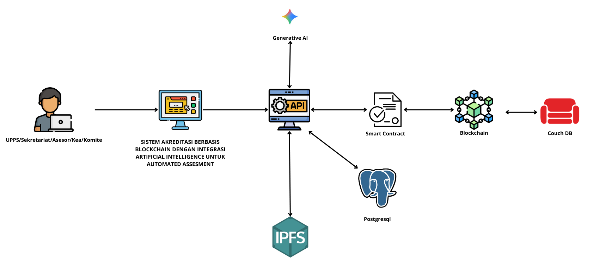
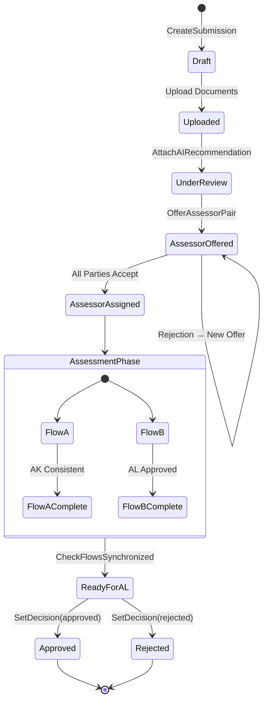
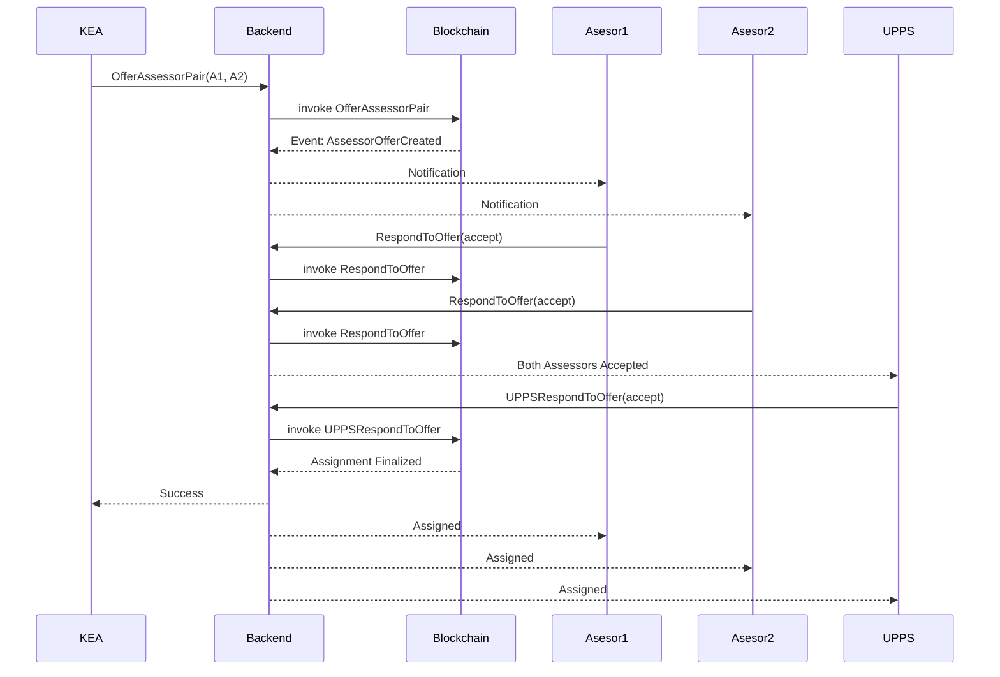
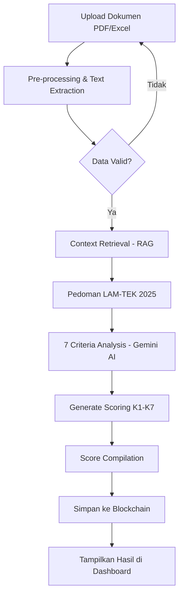

# BAB III  
# METODOLOGI PENELITIAN DAN PERANCANGAN SISTEM

---

## 3.1 Pendekatan Penelitian

Penelitian ini mengadopsi pendekatan **Design Science Research (DSR)** sebagai kerangka metodologis utama. DSR dipilih karena relevansinya yang tinggi dalam bidang sistem informasi dan ilmu komputer, khususnya untuk penelitian yang bertujuan menghasilkan artefak inovatif—dalam hal ini, sistem akreditasi berbasis blockchain—sebagai solusi atas permasalahan praktis yang teridentifikasi. Menurut Hevner et al. (2004), DSR berfokus pada pengembangan dan evaluasi artefak IT yang dirancang untuk memecahkan masalah organisasi yang spesifik.

Proses penelitian dilaksanakan melalui tahapan iteratif yang meliputi:

| No | Tahapan | Deskripsi |
|----|---------|-----------|
| 1 | **Identifikasi Masalah dan Motivasi** | Menganalisis inefisiensi dan isu trust pada proses akreditasi konvensional |
| 2 | **Penetapan Tujuan Solusi** | Merancang sistem yang menjamin transparansi (*transparency*), ketidakubahan data (*immutability*), dan efisiensi melalui otomasi cerdas |
| 3 | **Perancangan dan Pengembangan** | Desain arsitektur *distributed ledger* dan pengembangan algoritma *smart contract* |
| 4 | **Demonstrasi** | Purwarupa sistem diuji dalam lingkungan simulasi |
| 5 | **Evaluasi** | Mengukur kinerja dan kesesuaian sistem terhadap kebutuhan akreditasi LAM-TEK |

---

## 3.2 Gambaran Umum Sistem AkreChain

**AkreChain** (*Accreditation Chain*) dirancang sebagai platform terdesentralisasi yang mengintegrasikan teknologi *permissioned blockchain* dengan kecerdasan buatan (AI) untuk mengelola siklus hidup akreditasi program studi. Berbeda dengan sistem konvensional yang bersifat tersentralisasi (client-server tradisional), AkreChain mendistribusikan otoritas data ke dalam jaringan *peer-to-peer* yang aman.

### 3.2.1 Entitas Organisasi dalam Ekosistem

Sistem ini memfasilitasi interaksi antara **lima entitas organisasi** dalam ekosistem akreditasi LAM-TEK:

| No | Entitas | Nama Lengkap | Peran dalam Sistem |
|----|---------|--------------|-------------------|
| 1 | **UPPS** | Unit Pengelola Program Studi | Pengaju akreditasi, menyediakan dokumen LED dan LKPS |
| 2 | **Sekretariat** | Sekretariat LAM-TEK | Administrator yang memverifikasi kelengkapan dokumen, mengelola aspek administratif, dan menyetujui jadwal |
| 3 | **KEA** | Komite Evaluasi Akreditasi | Menetapkan pasangan asesor dan memvalidasi konsistensi penilaian |
| 4 | **Asesor** | Asesor/Evaluator | Tenaga ahli yang melakukan penilaian AK (Asesmen Kecukupan) dan AL (Asesmen Lapangan) |
| 5 | **Majelis** | Majelis Akreditasi | Pengambil keputusan akhir untuk penetapan peringkat akreditasi |

### 3.2.2 Strategi Penyimpanan Data

Seluruh metadata transaksi dan status akreditasi disimpan secara permanen di dalam *ledger* blockchain, sementara dokumen fisik (file PDF/Excel) disimpan dalam jaringan penyimpanan terdesentralisasi (IPFS) untuk efisiensi penyimpanan (*off-chain storage*). Komponen AI diintegrasikan untuk memberikan pra-evaluasi otomatis terhadap kelengkapan dan substansi dokumen, mereduksi beban kerja verifikasi manual.

---

## 3.3 Arsitektur Sistem

Arsitektur AkreChain dibangun menggunakan pendekatan **Layered Architecture** (Arsitektur Berlapis) untuk menjamin modularitas, skalabilitas, dan keamanan. Berdasarkan implementasi sistem yang berjalan, arsitektur terdiri dari **6 lapisan** yang saling terintegrasi.


*Gambar 3.1 Arsitektur Sistem AkreChain (6 Layer)*

### 3.3.1 Layer 1 - Pengguna (User Layer)

Lima aktor utama yang mengakses sistem melalui web browser:

| Aktor | Deskripsi |
|-------|-----------|
| UPPS | Unit Pengelola Program Studi - Pengaju akreditasi |
| Sekretariat | Verifikasi dokumen & penjadwalan |
| KEA | Komisi Evaluasi Akreditasi - Penetapan asesor |
| Asesor | Assessors/Evaluators |
| Majelis Akreditasi | Final decision board |

### 3.3.2 Layer 2 - Antarmuka Web (Presentation Layer)

Dibangun menggunakan **React + Vite** dengan komponen frontend:

- Dashboard (per role)
- Upload Dokumen (LED, LKPS)
- Status Akreditasi
- Penilaian Asesor
- Scheduling AL/AD
- Manajemen Batch
- Laporan & Export

### 3.3.3 Layer 3 - Backend Services (Business Logic Layer)

**Node.js + Express** sebagai central server dengan service-service:

| Service | Fungsi |
|---------|--------|
| **AuthService** | Otentikasi dan otorisasi (JWT + RBAC) |
| **ScoringService** | Kalkulasi skor (LAM-TEK 2025 - 7 Kriteria) |
| **FabricService** | Integrasi blockchain |
| **PinataService** | IPFS storage |
| **SchedulingService** | Penjadwalan AL |
| **ConsistencyService** | Verifikasi skor |

### 3.3.4 Layer 4 - Penyimpanan Data (Storage Layer)

| Komponen | Fungsi |
|----------|--------|
| **PostgreSQL** | User data, submissions (off-chain) |
| **IPFS (Pinata)** | Document storage (off-chain) |
| **Hyperledger Fabric** | Blockchain records (on-chain) |
| **CouchDB** | World state database |

### 3.3.5 Layer 5 - Layanan Eksternal (External Services)

| Layanan | Fungsi |
|---------|--------|
| **Google Gemini AI** | Document analysis & scoring |
| **Fabric CA** | Certificate Authority untuk identitas digital |

### 3.3.6 Layer 6 - Output

- AI Scoring Results (7 Kriteria)
- Consistency Reports
- Accreditation Certificates
- Export: CSV, Excel, PDF
- Blockchain Verification

**Alur Data:** Pengguna → Web → Backend → Blockchain/AI → Output → External API

---

### 3.3.7 Arsitektur Sederhana (Simplified Architecture)



*Gambar 3.2 Arsitektur Sistem Sederhana - Alur Komponen Utama*

Gambar 3.2 menunjukkan alur komponen utama secara sederhana:

1. **User** (UPPS/Sekretariat/Asesor/KEA/Majelis) mengakses sistem
2. **Frontend** (React + Vite) sebagai antarmuka
3. **API Backend** (Express.js) sebagai orchestrator
4. **Generative AI** (Google Gemini) untuk analisis dokumen
5. **IPFS** untuk penyimpanan dokumen
6. **PostgreSQL** untuk data relasional
7. **Smart Contract** untuk logika bisnis blockchain
8. **Blockchain** (Hyperledger Fabric) untuk immutable records
9. **CouchDB** untuk world state queries

---

## 3.4 Perancangan Infrastruktur Blockchain

Infrastruktur jaringan blockchain AkreChain dirancang menggunakan platform **Hyperledger Fabric v2.5.12**. Pemilihan Fabric didasarkan pada arsitekturnya yang modular dan fitur privasi (*channel*) yang sesuai dengan proses akreditasi yang membutuhkan kerahasiaan data antar institusi namun transparan bagi asesor dan sekretariat.


*Gambar 3.3 Topologi Jaringan Blockchain AkreChain*

### 3.4.1 Komponen Jaringan

#### A. Organizations (Organisasi)

Arsitektur jaringan terdiri dari **5 organisasi otonom** yang merepresentasikan stakeholder dalam ekosistem akreditasi LAM-TEK:

| No | Organisasi | Nama Lengkap | MSP ID | Port CouchDB |
|----|------------|--------------|--------|--------------|
| 1 | **UPPS** | Unit Pengelola Program Studi | UPPSMSP | 5100 |
| 2 | **Sekretariat** | Sekretariat LAM-TEK | SekadminMSP | 5120 |
| 3 | **KEA** | Komisi Evaluasi Akreditasi | KEAMSP | 5160 |
| 4 | **Asesor** | Assessor/Evaluator | AsesorMSP | 5180 |
| 5 | **Majelis** | Majelis Akreditasi | MajelisMSP | 5200 |

#### B. Peers

Setiap organisasi mengelola minimal satu *Peer Node* (peer0) yang menyimpan salinan *ledger* dan mengeksekusi *chaincode*. Peer menggunakan **CouchDB** sebagai *state database* untuk mendukung *rich query*.

#### C. Ordering Service

Menggunakan mekanisme konsensus **Solo** (untuk development) yang dapat ditingkatkan ke **Raft** (etcdRaft) untuk production, bertanggung jawab untuk mengurutkan transaksi dan membentuk blok.

#### D. Channel

Dibuat sebuah *channel* bernama `akreditasi` yang menghubungkan seluruh 5 organisasi, mengisolasi transaksi akreditasi sehingga hanya pihak yang berwenang dalam channel tersebut yang dapat mengakses data.

#### E. Chaincode

Smart contract `submission-contract` di-deploy pada channel `akreditasi` dengan endorsement policy:

```
OR('UPPSMSP.member', 'SekadminMSP.member', 'KEAMSP.member', 'AsesorMSP.member', 'MajelisMSP.member')
```

#### F. Certificate Authority (CA)

Setiap organisasi memiliki CA masing-masing yang mengelola identitas digital (X.509 certificates) untuk setiap entitas (user, peer, orderer), menjamin otentikasi yang kuat dalam jaringan (*Permissioned Network*).

---

## 3.5 Analisis dan Perancangan Smart Contract

Logika bisnis inti ditanamkan ke dalam blockchain dalam bentuk *Smart Contract* (Chaincode) yang ditulis menggunakan bahasa **TypeScript** dengan framework `fabric-contract-api`. Berbeda dengan *Smart Contract* sederhana yang hanya mencatat *hash*, AkreChain mengimplementasikan logika orkestrasi proses bisnis yang kompleks (*Complex Business Process Orchestration*).

### 3.5.1 Struktur Data Ledger

Data disimpan dalam struktur JSON `Submission` yang komprehensif dengan skema sebagai berikut:

```typescript
interface Submission {
    // Metadata Utama
    submissionId: string;           // ID unik pengajuan
    programStudi: string;           // Nama program studi
    institusi: string;              // Nama institusi
    programType?: string;           // Jenis program (S1, S2, D3, dll)
    
    // Dokumen & Status
    documents: Document[];          // Array dokumen (CID IPFS + hash)
    status: 'draft' | 'uploaded' | 'processing' | 'under_review' | 'approved' | 'rejected';
    version: number;                // Versi revisi dokumen
    
    // Analisis AI
    ai?: AIRecommendation;          // Hasil analisis AI (skor, rekomendasi)
    
    // Penugasan Asesor (Fase 3A)
    currentOffer?: AssessorOffer;   // Penawaran asesor aktif
    offerHistory?: AssessorOffer[]; // Riwayat penawaran
    assignedAssessors?: {           // Asesor yang ditugaskan
        assessor1Id, assessor1Name,
        assessor2Id, assessor2Name,
        assignedAt
    };
    
    // Asesmen Kecukupan (AK)
    akAssessments?: AKAssessment[]; // Penilaian AK dari kedua asesor
    akConsistent?: boolean;         // Status konsistensi nilai AK
    
    // Penjadwalan Asesmen Lapangan (AL) - Fase 3B
    alSchedule?: ALSchedule;        // Jadwal AL aktif
    alScheduleHistory?: ALSchedule[];
    
    // Sinkronisasi Alur Paralel
    flowSyncStatus?: FlowSyncStatus; // Status sinkronisasi Flow A & B
    
    // Keputusan Akhir
    decision?: Decision;            // Keputusan approval/rejection
    
    // Audit Trail
    createdAt: string;
    updatedAt: string;
    submittedBy: string;
    submittedByMsp: string;
}
```

### 3.5.2 Mekanisme Access Control (MSP-Based)

Setiap fungsi chaincode dilindungi oleh validasi MSP (*Membership Service Provider*) yang memastikan hanya organisasi yang berwenang yang dapat mengeksekusi fungsi tertentu:

```typescript
private assertMSP(ctx: Context, allowedMSPs: string[], action: string) {
    const mspId = ctx.clientIdentity.getMSPID();
    if (!allowedMSPs.includes(mspId)) {
        throw new Error(`Access denied for ${action}. Required MSPs: ${allowedMSPs.join(', ')}`);
    }
    return mspId;
}
```

### 3.5.3 Fungsi-Fungsi Utama Chaincode

Kontrak cerdas menyediakan **16 fungsi transaksional** yang terbagi dalam 4 fase utama:

#### Fase 1: Inisiasi dan Pengajuan

| Fungsi | MSP yang Diizinkan | Deskripsi |
|--------|-------------------|-----------|
| `CreateSubmission` | UPPS, Sekretariat | Membuat record pengajuan baru di ledger |
| `AttachAIRecommendation` | UPPS, Sekretariat | Menautkan hasil analisis AI ke submission |
| `UpdateDocuments` | UPPS, Sekretariat | Update dokumen untuk siklus revisi |

#### Fase 2: Penugasan Asesor (Three-Way Handshake)

| Fungsi | MSP yang Diizinkan | Deskripsi |
|--------|-------------------|-----------|
| `OfferAssessorPair` | KEA, Sekretariat | KEA menawarkan pasangan asesor |
| `RespondToOffer` | Asesor | Asesor menerima/menolak penugasan |
| `UPPSRespondToOffer` | UPPS | UPPS menyetujui/menolak pasangan asesor |

#### Fase 3A: Asesmen Kecukupan (AK) - Flow A

| Fungsi | MSP yang Diizinkan | Deskripsi |
|--------|-------------------|-----------|
| `SubmitAKAssessment` | Asesor | Asesor submit nilai AK per kriteria |
| `CheckAKConsistency` | KEA, Sekretariat | Validasi konsistensi nilai antar asesor |

#### Fase 3B: Penjadwalan AL - Flow B (Paralel dengan Flow A)

| Fungsi | MSP yang Diizinkan | Deskripsi |
|--------|-------------------|-----------|
| `ProposeALSchedule` | KEA, Sekretariat | Mengusulkan jadwal dan venue AL |
| `ApproveALSchedule` | Sekretariat | Menyetujui/menolak jadwal AL |

#### Fase 4: Sinkronisasi dan Finalisasi

| Fungsi | MSP yang Diizinkan | Deskripsi |
|--------|-------------------|-----------|
| `CheckFlowsSynchronized` | KEA, Sekretariat | Parallel Gateway - cek kedua flow selesai |
| `SetDecision` | Sekretariat, KEA, Asesor, Majelis | Penetapan keputusan akhir |
| `SetScoringResult` | Asesor, Sekretariat, KEA | Menyimpan hasil skoring final |

### 3.5.4 Mekanisme Parallel Gateway (Flow Synchronization)

Salah satu fitur penting dalam smart contract adalah **Parallel Gateway** yang memastikan dua alur proses (Flow A dan Flow B) berjalan secara paralel dan tersinkronisasi sebelum melanjutkan ke tahap berikutnya:

```typescript
interface FlowSyncStatus {
    flowACompleted: boolean;    // AK Assessment consistent
    flowACompletedAt?: string;
    flowBCompleted: boolean;    // AL Schedule approved  
    flowBCompletedAt?: string;
    syncCompleted: boolean;     // Both flows finished
    syncCompletedAt?: string;
    readyForAL: boolean;        // Ready for field assessment
}
```

Fungsi `CheckFlowsSynchronized` bertindak sebagai *Logic Gate*:

- Memverifikasi **Flow A**: Skor AK telah konsisten antar asesor (`akConsistent === true`)
- Memverifikasi **Flow B**: Jadwal AL telah disetujui (`alSchedule.status === 'approved'`)
- Jika kedua kondisi terpenuhi, sistem berpindah ke status `readyForAL = true`

Pendekatan ini menjamin **integritas alur kerja** (*workflow integrity*), di mana tidak ada tahapan yang dapat dilompati secara ilegal.

### 3.5.5 Event-Driven Architecture

Smart contract mengimplementasikan arsitektur berbasis event untuk notifikasi real-time ke sistem off-chain:

| Event | Trigger | Data yang Dikirim |
|-------|---------|-------------------|
| `SubmissionCreated` | CreateSubmission | submissionId, programStudi, institusi, timestamp |
| `AIRecommendationAttached` | AttachAIRecommendation | submissionId, score, timestamp |
| `AssessorOfferCreated` | OfferAssessorPair | submissionId, offerId, assessor1Id, assessor2Id |
| `AssessorResponded` | RespondToOffer | submissionId, assessorId, response |
| `AKAssessmentSubmitted` | SubmitAKAssessment | submissionId, assessorId, timestamp |
| `ALScheduleProposed` | ProposeALSchedule | submissionId, scheduleId, proposedDate |
| `ALScheduleApproved` | ApproveALSchedule | submissionId, approved, approvedBy |
| `FlowsSynchronized` | CheckFlowsSynchronized | submissionId, flowACompletedAt, flowBCompletedAt |
| `SubmissionDecided` | SetDecision | submissionId, status, timestamp |

---

## 3.6 Alur Kerja Sistem dan Interaksi Komponen

Alur kerja AkreChain dirancang untuk meminimalkan *bottleneck* administratif melalui otomatisasi. Interaksi antar komponen dapat dijelaskan melalui skenario *Sequence* yang menghubungkan aktor manusia, sistem *off-chain*, dan jaringan blockchain.

### 3.6.1 Diagram Alur Subsistem

Sistem AkreChain terdiri dari beberapa subsistem yang saling terintegrasi:

```
┌─────────────────────────────────────────────────────────────────────────────┐
│                          PRESENTATION LAYER                                  │
│  ┌─────────────┐  ┌─────────────┐  ┌─────────────┐  ┌─────────────┐         │
│  │ Dashboard   │  │ Submission  │  │ Assessment  │  │ Scheduling  │         │
│  │ UPPS        │  │ Management  │  │ Module      │  │ Module      │         │
│  └──────┬──────┘  └──────┬──────┘  └──────┬──────┘  └──────┬──────┘         │
│         │                │                │                │                 │
│         └────────────────┴────────────────┴────────────────┘                 │
│                                   │                                          │
│                          React + Vite Frontend                               │
└───────────────────────────────────┬─────────────────────────────────────────┘
                                    │ REST API / WebSocket
┌───────────────────────────────────┼─────────────────────────────────────────┐
│                    BUSINESS LOGIC LAYER (Off-Chain)                         │
│  ┌────────────────────────────────┼────────────────────────────────────┐    │
│  │              Express.js API Gateway (Node.js)                       │    │
│  │  ┌──────────────┐  ┌──────────────┐  ┌──────────────┐              │    │
│  │  │ Auth Module  │  │ Submission   │  │ Assessment   │              │    │
│  │  │ (JWT/MSP)    │  │ Controller   │  │ Controller   │              │    │
│  │  └──────────────┘  └──────────────┘  └──────────────┘              │    │
│  └────────────────────────────────┬────────────────────────────────────┘    │
│                                   │                                          │
│  ┌────────────────┐  ┌────────────┴───────────┐  ┌─────────────────┐        │
│  │ Gemini AI      │  │ Hyperledger Fabric SDK │  │ IPFS Gateway    │        │
│  │ Service        │  │ (fabric-network)       │  │ (Pinata)        │        │
│  └────────────────┘  └────────────────────────┘  └─────────────────┘        │
└───────────────────────────────────┬─────────────────────────────────────────┘
                                    │
┌───────────────────────────────────┼─────────────────────────────────────────┐
│                    BLOCKCHAIN & STORAGE LAYER (On-Chain)                     │
│                                   │                                          │
│  ┌────────────────────────────────┴────────────────────────────────────┐    │
│  │                    Channel: akreditasi                               │    │
│  │  ┌──────────────────────────────────────────────────────────────┐   │    │
│  │  │              Chaincode: submission-contract                   │   │    │
│  │  │  • CreateSubmission      • SubmitAKAssessment                │   │    │
│  │  │  • AttachAIRecommendation • ProposeALSchedule                │   │    │
│  │  │  • OfferAssessorPair     • ApproveALSchedule                 │   │    │
│  │  │  • RespondToOffer        • CheckFlowsSynchronized            │   │    │
│  │  │  • SetDecision           • QuerySubmission                   │   │    │
│  │  └──────────────────────────────────────────────────────────────┘   │    │
│  └─────────────────────────────────────────────────────────────────────┘    │
│                                                                              │
│  ┌─────────┐  ┌─────────┐  ┌─────────┐  ┌─────────┐  ┌─────────┐           │
│  │  UPPS   │  │Sekretariat│ │   KEA   │  │ Asesor  │  │ Majelis │           │
│  │  Peer0  │  │  Peer0  │  │  Peer0  │  │  Peer0  │  │  Peer0  │           │
│  │ CouchDB │  │ CouchDB │  │ CouchDB │  │ CouchDB │  │ CouchDB │           │
│  │  5100   │  │  5120   │  │  5160   │  │  5180   │  │  5200   │           │
│  └─────────┘  └─────────┘  └─────────┘  └─────────┘  └─────────┘           │
│                                                                              │
│                    ┌──────────────────────────┐                             │
│                    │    Ordering Service      │                             │
│                    │    (Solo/Raft)           │                             │
│                    └──────────────────────────┘                             │
└──────────────────────────────────────────────────────────────────────────────┘
```

*Gambar 3.4 Diagram Alur Subsistem AkreChain*

### 3.6.2 Sequence Diagram: Proses Pengajuan dan Analisis AI

```
┌──────┐     ┌──────────┐     ┌─────────┐     ┌──────┐     ┌───────────┐
│ UPPS │     │ Frontend │     │ Backend │     │ IPFS │     │ Blockchain│
└──┬───┘     └────┬─────┘     └────┬────┘     └──┬───┘     └─────┬─────┘
   │              │                │             │               │
   │ Upload LED/LKPS              │             │               │
   │──────────────>               │             │               │
   │              │ POST /api/submissions       │               │
   │              │───────────────>             │               │
   │              │                │ Store PDF  │               │
   │              │                │────────────>               │
   │              │                │    CID     │               │
   │              │                │<───────────│               │
   │              │                │             │               │
   │              │                │ Extract Text + Analyze     │
   │              │                │──────────────────┐         │
   │              │                │ (Gemini AI)      │         │
   │              │                │<─────────────────┘         │
   │              │                │             │               │
   │              │                │ CreateSubmission(metadata+CID+AI)
   │              │                │─────────────────────────────>
   │              │                │             │    Event:     │
   │              │                │             │ SubmissionCreated
   │              │                │<────────────────────────────│
   │              │ 201 Created    │             │               │
   │              │<───────────────│             │               │
   │ Success      │                │             │               │
   │<─────────────│                │             │               │
```

*Gambar 3.5 Sequence Diagram - Proses Pengajuan dan Analisis AI*

### 3.6.3 Sequence Diagram: Three-Way Handshake Penugasan Asesor

```
┌──────┐  ┌─────┐  ┌────────────┐  ┌─────────┐  ┌───────────┐
│  KEA │  │UPPS │  │ Asesor 1&2 │  │ Backend │  │ Blockchain│
└──┬───┘  └──┬──┘  └─────┬──────┘  └────┬────┘  └─────┬─────┘
   │         │           │              │             │
   │ OfferAssessorPair(assessor1, assessor2)         │
   │────────────────────────────────────>             │
   │         │           │              │────────────>│
   │         │           │              │ Event:      │
   │         │           │              │ AssessorOfferCreated
   │         │           │<─────────────│             │
   │         │           │ Notif: Penugasan Baru     │
   │         │           │              │             │
   │         │           │ RespondToOffer(accept)    │
   │         │           │─────────────>│             │
   │         │           │              │────────────>│
   │         │           │              │             │
   │         │ Notif: Asesor Accepted   │             │
   │         │<─────────────────────────│             │
   │         │           │              │             │
   │         │ UPPSRespondToOffer(accept)            │
   │         │─────────────────────────>│             │
   │         │           │              │────────────>│
   │         │           │              │             │
   │         │           │     Assignment Finalized  │
   │<────────│<──────────│<─────────────│<────────────│
```

*Gambar 3.6 Sequence Diagram - Three-Way Handshake Penugasan Asesor*

### 3.6.4 Diagram Alur Paralel: Flow A (AK) dan Flow B (AL Scheduling)

```
                        ┌─────────────────────┐
                        │  Asesor Assigned    │
                        └──────────┬──────────┘
                                   │
                    ┌──────────────┴──────────────┐
                    │      Parallel Gateway       │
                    │         (Fork)              │
                    └──────────────┬──────────────┘
                                   │
              ┌────────────────────┼────────────────────┐
              │                    │                    │
              ▼                    │                    ▼
    ┌─────────────────┐            │          ┌─────────────────┐
    │    FLOW A       │            │          │    FLOW B       │
    │ Asesmen Kecukupan│           │          │ AL Scheduling   │
    └────────┬────────┘            │          └────────┬────────┘
             │                     │                   │
    ┌────────▼────────┐            │          ┌────────▼────────┐
    │ Asesor 1 Submit │            │          │ KEA Propose     │
    │ AK Assessment   │            │          │ AL Schedule     │
    └────────┬────────┘            │          └────────┬────────┘
             │                     │                   │
    ┌────────▼────────┐            │          ┌────────▼────────┐
    │ Asesor 2 Submit │            │          │ Sekretariat     │
    │ AK Assessment   │            │          │ Approve Schedule│
    └────────┬────────┘            │          └────────┬────────┘
             │                     │                   │
    ┌────────▼────────┐            │          ┌────────▼────────┐
    │ KEA Check       │            │          │ flowBCompleted  │
    │ Consistency     │            │          │ = true          │
    └────────┬────────┘            │          └────────┬────────┘
             │                     │                   │
    ┌────────▼────────┐            │                   │
    │ flowACompleted  │            │                   │
    │ = true          │            │                   │
    └────────┬────────┘            │                   │
             │                     │                   │
             └─────────────────────┼───────────────────┘
                                   │
                    ┌──────────────▼──────────────┐
                    │      Parallel Gateway       │
                    │         (Join)              │
                    │  CheckFlowsSynchronized()   │
                    └──────────────┬──────────────┘
                                   │
                        ┌──────────▼──────────┐
                        │   readyForAL = true │
                        │   Proceed to AL     │
                        └─────────────────────┘
```

*Gambar 3.7 Diagram Alur Paralel - Flow A (AK) dan Flow B (AL Scheduling)*

### 3.6.5 Analisis Mekanisme On-Chain dan Off-Chain

Untuk mengatasi batasan skalabilitas dan biaya penyimpanan pada blockchain, sistem menerapkan pola **Hybrid Storage Architecture** dengan pemisahan yang jelas antara data on-chain dan off-chain.

#### A. Data On-Chain (Disimpan di Ledger Hyperledger Fabric)

Data yang disimpan secara *on-chain* adalah data yang membutuhkan **integritas tinggi**, **auditabilitas**, dan menjadi **dasar pengambilan keputusan** (konsensus).

| Kategori | Data yang Disimpan | Alasan |
|----------|-------------------|--------|
| **Identitas & Akses** | User ID, MSP ID, Role, Signature | Otentikasi & otorisasi |
| **Metadata Bisnis** | submissionId, programStudi, institusi, status, version | Tracking state |
| **Bukti Integritas** | CID IPFS (hash dokumen), hash analisis AI | Tamper-proof verification |
| **Hasil Penilaian** | AK scores, consistency status, decision | Immutable audit trail |
| **State Machine** | flowSyncStatus, currentOffer, assignedAssessors | Workflow orchestration |
| **Timestamps** | createdAt, updatedAt, decidedAt | Kronologi legal |

**Karakteristik Data On-Chain:**
- Ukuran kecil (< 1 MB per transaksi)
- Memerlukan konsensus antar organisasi
- Bersifat permanen (*immutable*)
- Dapat di-query menggunakan CouchDB rich queries

#### B. Data Off-Chain (Disimpan di IPFS & Database Lokal)

Data yang bersifat **statis**, **berukuran besar**, atau **data sementara** yang tidak memerlukan konsensus blockchain.

| Lokasi Penyimpanan | Data | Ukuran Tipikal |
|-------------------|------|----------------|
| **IPFS (Pinata)** | Dokumen LED (PDF) | 5-50 MB |
| **IPFS (Pinata)** | Dokumen LKPS (Excel/PDF) | 1-10 MB |
| **PostgreSQL (Backend)** | Detail user, session, cache | Variable |
| **PostgreSQL (Backend)** | Hasil analisis AI mentah | 10-100 KB |
| **File System** | Logs, temporary files | Variable |

#### C. Mekanisme Linking On-Chain ↔ Off-Chain

```
┌─────────────────────────────────────────────────────────────────┐
│                         IPFS Network                             │
│  ┌─────────────────────────────────────────────────────────┐    │
│  │  LED.pdf  ────────────────────────────────────────────  │    │
│  │  CID: QmX7b8Jp3xK9LmNpQr2sT4vWxYz1A2bC3dE4fG5hI6jK7l   │    │
│  └─────────────────────────────────────────────────────────┘    │
└─────────────────────────────────────────────────────────────────┘
                              │
                              │ Hash Pointer (CID)
                              ▼
┌─────────────────────────────────────────────────────────────────┐
│                    Hyperledger Fabric Ledger                     │
│  ┌─────────────────────────────────────────────────────────┐    │
│  │  {                                                       │    │
│  │    "submissionId": "SUB-2026-001",                      │    │
│  │    "documents": [                                        │    │
│  │      {                                                   │    │
│  │        "type": "LED",                                    │    │
│  │        "cid": "QmX7b8Jp3xK9LmNpQr2sT4vWxYz1A2bC3dE4fG5h",│    │
│  │        "hash": "sha256:a1b2c3d4e5f6...",                 │    │
│  │        "verified": true                                  │    │
│  │      }                                                   │    │
│  │    ],                                                    │    │
│  │    "ai": { "scoreCompleteness": 85, ... }               │    │
│  │  }                                                       │    │
│  └─────────────────────────────────────────────────────────┘    │
└─────────────────────────────────────────────────────────────────┘
```

*Gambar 3.8 Mekanisme Linking On-Chain dan Off-Chain*

#### D. Keuntungan Arsitektur Hybrid

| Aspek | Manfaat |
|-------|---------|
| **Skalabilitas** | Ledger tetap ringan, tidak membengkak dengan file besar |
| **Throughput** | Transaksi cepat karena payload minimal |
| **Integritas** | Hash di blockchain menjamin file IPFS tidak dimodifikasi |
| **Biaya** | Penyimpanan IPFS lebih murah dibanding on-chain |
| **Privasi** | File bisa dienkripsi off-chain, hanya hash yang publik |

Pemisahan ini memastikan bahwa jaringan blockchain tetap ringan dan cepat (*high throughput*), sementara integritas data dokumen tetap terjamin secara matematis melalui fungsi *hashing* SHA-256 yang ditautkan ke ledger.

---

## 3.7 Perancangan Modul Cerdas (AI Integration)

Salah satu kebaruan (*novelty*) dalam AkreChain adalah integrasi modul kecerdasan buatan untuk membantu proses asesmen. Modul ini menggunakan *Large Language Model* (LLM) **Google Gemini** yang diakses melalui API dengan pendekatan **RAG (Retrieval-Augmented Generation)**.


*Gambar 3.9 Alur Kerja Prototipe AI - AkreChain*

### 3.7.1 Layer Alur Kerja AI

Berdasarkan Gambar 3.9, alur kerja modul AI terdiri dari 4 layer:

#### Layer 1 - Pengguna (UPPS Admin)

| Aktivitas | Deskripsi |
|-----------|-----------|
| **Upload Dokumen** | User mengunggah file PDF (LED) dan Excel (LKPS) |
| **Lihat Skor Per Kriteria** | Hasil akhir ditampilkan dalam dashboard |

#### Layer 2 - Sistem (Orchestrator)

| Komponen | Fungsi |
|----------|--------|
| **Pre-processing** | Ekstraksi teks dari PDF/Excel |
| **Rule-Based Validation** | Validasi format dan kelengkapan data |
| **Data Valid?** | Decision point - jika tidak valid, kembali ke user untuk perbaikan |
| **Score Compilation** | Kompilasi hasil skor dari AI |

#### Layer 3 - AI Engine (Google Gemini + RAG)

| Komponen | Fungsi |
|----------|--------|
| **Context Retrieval (RAG)** | Mengambil konteks dari Pedoman LAM-TEK 2025 |
| **7 Criteria Analysis** | Analisis dokumen berdasarkan 7 kriteria akreditasi |
| **Generate Scoring** | Menghasilkan skor per kriteria (K1-K7) dengan nilai numerik |

#### Layer 4 - Blockchain (Hyperledger Fabric)

| Komponen | Fungsi |
|----------|--------|
| **Simpan Metadata dan Skor** | Hash hasil analisis disimpan ke ledger |
| **Immutable Record** | Metadata & skor tercatat secara permanen |

**Alur Data:** Dokumen (PDF/Excel) → Ekstraksi Teks → Validasi Rules → Analisis AI (RAG) → Skor Final → Blockchain Ledger

### 3.7.2 Mekanisme RAG (Retrieval-Augmented Generation)

Sistem menggunakan pendekatan RAG untuk meningkatkan akurasi penilaian:

| Komponen | Deskripsi |
|----------|----------|
| **Knowledge Base** | Pedoman Penilaian LAM-TEK 2025 (7 Kriteria, 50+ Indikator) |
| **Retrieval** | Mencari indikator relevan berdasarkan konten dokumen |
| **Augmentation** | Menggabungkan konteks pedoman dengan teks dokumen |
| **Generation** | Gemini AI menghasilkan skor dan rekomendasi |

### 3.7.3 Output AI Scoring

Hasil analisis AI menghasilkan output dalam format JSON terstruktur:

```json
{
  "scoring_summary": {
    "K1": { "score": 85, "max": 100, "indicators": [...] },
    "K2": { "score": 90, "max": 100, "indicators": [...] },
    "K3": { "score": 85, "max": 100, "indicators": [...] },
    "K4": { "score": 90, "max": 100, "indicators": [...] },
    "K5": { "score": 85, "max": 100, "indicators": [...] },
    "K6": { "score": 90, "max": 100, "indicators": [...] },
    "K7": { "score": 88, "max": 100, "indicators": [...] },
    "total_score": 613,
    "overall_percentage": 87.57
  },
  "recommendations": [...],
  "flags": [...]
}
```

---

## 3.8 Justifikasi Teknis dan Keamanan

Pemilihan teknologi dan desain arsitektur didasarkan pada analisis kebutuhan non-fungsional sistem yang kritikal:

| No | Aspek | Implementasi | Manfaat |
|----|-------|--------------|---------|
| 1 | **Integritas Data** (*Data Integrity*) | Penggunaan *hash chain* pada Hyperledger Fabric | Menjamin sejarah data akreditasi tidak dapat dimanipulasi (*tamper-proof*), menjawab masalah potensi kecurangan atau perubahan data pasca-asesmen |
| 2 | **Ketersediaan Data** (*Availability*) | Penyimpanan dokumen di IPFS (Pinata) | Mendistribusikan data secara redundan, mencegah *Single Point of Failure* yang sering terjadi pada server penyimpanan terpusat |
| 3 | **Privasi** (*Privacy*) | Implementasi *Private Data Collections* (PDC) atau mekanisme *Channel* pada Fabric | Memungkinkan data sensitif hanya dapat dibuka oleh pihak yang berkepentingan, sesuai dengan etika kerahasiaan data institusi |
| 4 | **Skalabilitas** (*Scalability*) | Arsitektur *off-chain* (menyimpan hash saja di blockchain, data asli di IPFS) | Strategi *best-practice* untuk mengatasi batasan ukuran blok dan throughput transaksi, memastikan sistem tetap responsif meski volume dokumen meningkat |

---

## 3.9 Diagram dan Visualisasi Sistem

### 3.9.1 Daftar Gambar yang Tersedia

| No | Nama File | Deskripsi | Referensi |
|----|-----------|-----------|----------|
| 1 | `Arsitektur Sistem.png` | Arsitektur 6-layer sistem AkreChain | Gambar 3.1 |
| 2 | `arsitektur.png` | Arsitektur sederhana (komponen utama) | Gambar 3.2 |
| 3 | `Arsitektur Jaringan Blockchain.png` | Topologi jaringan 5 organisasi | Gambar 3.3 |
| 4 | `Prototype AI.png` | Alur kerja AI dengan RAG | Gambar 3.9 |

### 3.9.2 State Machine Diagram (Mermaid.js)



*Gambar 3.10 State Machine Diagram - Lifecycle Submission*

### 3.9.3 Sequence Diagram Three-Way Handshake (Mermaid.js)



*Gambar 3.11 Sequence Diagram - Three-Way Handshake*

### 3.9.4 Flowchart AI Processing (Mermaid.js)



*Gambar 3.12 Flowchart - AI Processing*

---

## 3.10 Ringkasan Teknologi yang Digunakan

| Kategori | Teknologi | Versi | Fungsi |
|----------|-----------|-------|--------|
| **Blockchain Platform** | Hyperledger Fabric | 2.5.12 | Distributed ledger, smart contract |
| **Smart Contract** | TypeScript + fabric-contract-api | - | Business logic on-chain |
| **Backend** | Node.js + Express.js | - | API gateway, orchestrator |
| **Frontend** | React + Vite | - | User interface |
| **Database (Off-chain)** | PostgreSQL | - | Relational data storage |
| **State Database** | CouchDB | - | World state, rich queries |
| **File Storage** | IPFS (Pinata) | - | Decentralized document storage |
| **AI/ML** | Google Gemini | - | Document analysis, scoring |
| **Container** | Docker + Fablo | - | Network orchestration |
| **Consensus** | Solo (Dev) / Raft (Prod) | - | Transaction ordering |

---

## Referensi

1. Hevner, A. R., March, S. T., Park, J., & Ram, S. (2004). Design science in information systems research. *MIS Quarterly*, 28(1), 75-105.

---

*Dokumen ini merupakan BAB III dari penelitian "Sistem Akreditasi Berbasis Blockchain dengan Integrasi AI untuk Automated Assessment" - AkreChain*
