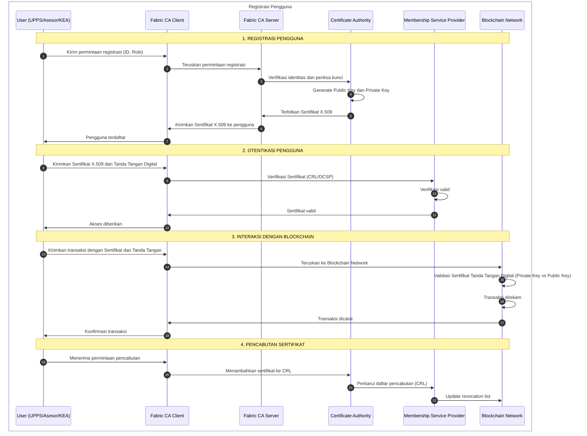
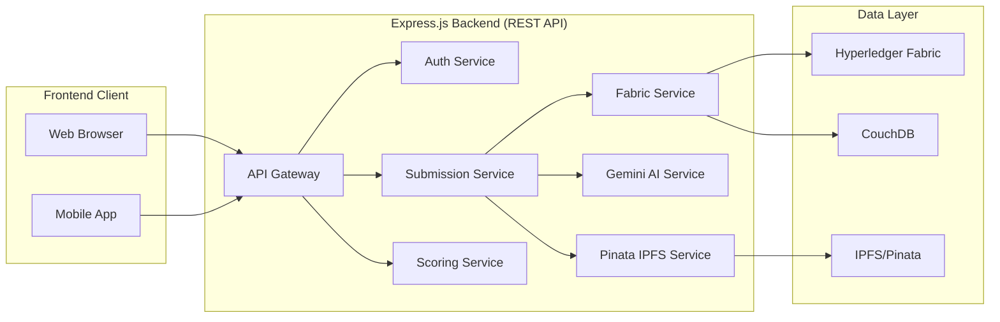
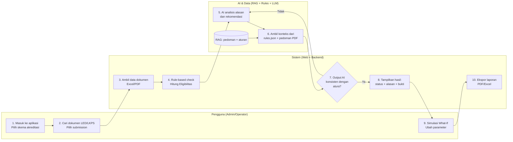
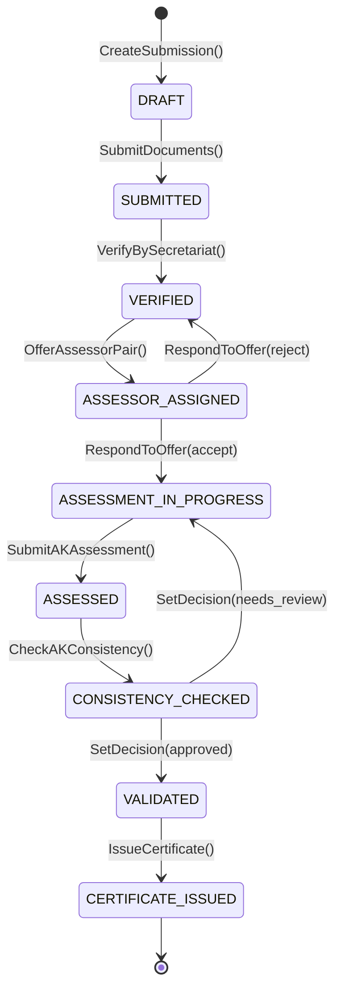
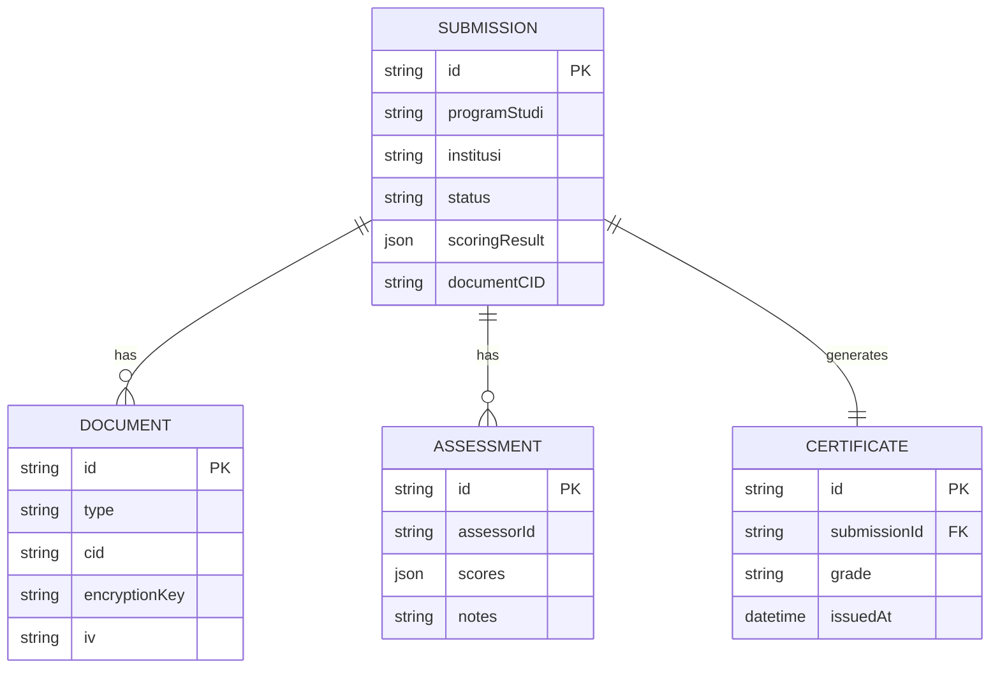
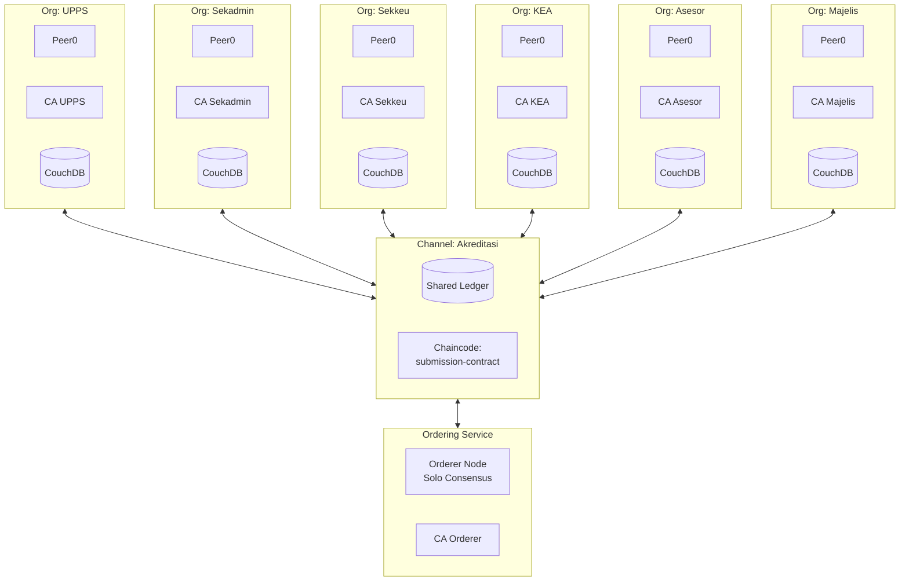

# Prompts Generasi Gambar AkreChain untuk Gemini

Prompt ini dibuat berdasarkan **analisis langsung** dari 6 contoh gambar di folder `docs/6 gambar` dan kode aplikasi AkreChain. Gaya visual mengikuti format diagram teknis akademik.

---

## 1. Identity Management (MSP)
**Referensi Visual:** Gambar 1 - Diagram alur registrasi dan otentikasi pengguna dengan swimlane horizontal.

### Kode Mermaid (untuk referensi)



### Prompt untuk Gemini
> Create a **UML Sequence Diagram** for "Identity Management (MSP) in AkreChain Accreditation System".
>
> **Participants (6 columns from left to right):**
> 1. **User** - Icon: person with laptop. Label: "Pengguna (UPPS/Asesor/KEA/Sekretariat/Majelis)"
> 2. **Fabric CA Client** - Icon: computer terminal
> 3. **Fabric CA Server** - Icon: server rack
> 4. **Certificate Authority (CA)** - Icon: shield with checkmark
> 5. **Membership Service Provider (MSP)** - Icon: ID card
> 6. **Blockchain Network** - Icon: chain of blocks
>
> **Flow Sections with Colored Headers:**
>
> **Section 1 - REGISTRASI PENGGUNA (Blue #4A90D9 header bar):**
> - Arrow 1: User → FC: "Kirim permintaan registrasi (ID, Role)"
> - Arrow 2: FC → FCS: "Teruskan permintaan registrasi"
> - Arrow 3: FCS → CA: "Verifikasi identitas dan periksa kunci"
> - Arrow 4: CA → CA: "Generate Public Key dan Private Key"
> - Arrow 5: CA → FCS: "Terbitkan Sertifikat X.509"
> - Arrow 6: FCS → FC → U: "Kirimkan Sertifikat X.509 ke pengguna"
>
> **Section 2 - OTENTIKASI PENGGUNA (Green #5CB85C header bar):**
> - Arrow 7: User → FC: "Kirimkan Sertifikat X.509 dan Tanda Tangan Digital"
> - Arrow 8: FC → MSP: "Verifikasi Sertifikat (CRL/OCSP)"
> - Arrow 9: MSP → MSP: "Verifikasi valid"
> - Arrow 10: MSP → FC → U: "Akses diberikan"
>
> **Section 3 - INTERAKSI DENGAN BLOCKCHAIN (Orange #F0AD4E header bar):**
> - Arrow 11: User → FC: "Kirimkan transaksi dengan Sertifikat dan Tanda Tangan"
> - Arrow 12: FC → BN: "Teruskan ke Blockchain Network"
> - Arrow 13: BN → BN: "Validasi Sertifikat Tanda Tangan Digital"
> - Arrow 14: BN → FC → U: "Transaksi dicatat"
>
> **Section 4 - PENCABUTAN SERTIFIKAT (Red #D9534F header bar):**
> - Arrow 15: User → FC: "Menerima permintaan pencabutan"
> - Arrow 16: FC → CA: "Menambahkan sertifikat ke CRL"
> - Arrow 17: CA → MSP → BN: "Perbarui daftar pencabutan"
>
> **Left Side Summary Box:**
> "Modul Manajemen User:
> 1. Registrasi Pengguna
> 2. Otentikasi Pengguna
> 3. Interaksi dengan Blockchain
> 4. Pencabutan Sertifikat"
>
> **Style:** Clean academic sequence diagram with numbered arrows, colored section header bars, straight horizontal arrows, Indonesian labels, white background. Sans-serif font (Arial/Helvetica). Resolution: 1920x1080 or higher.

---

## 2. Desain Webservice dan API
**Referensi Visual:** Gambar 2 - Tabel endpoint API di kiri, diagram alur transaksi di tengah/kanan.

### Kode Mermaid (untuk referensi)



### Prompt untuk Gemini
> Create a **REST API Documentation Diagram** for "AkreChain Webservice and API".
>
> **Layout:** 2-panel table view (Left Panel dan Right Panel berisi tabel-tabel API)
>
> **LEFT PANEL - API Tables (4 Groups):**
>
> **Auth API** `/api/v1/auth` (Blue #2196F3 header):
> | Nama API | Endpoint | Method | Deskripsi |
> |----------|----------|--------|-----------|
> | Register | /register | POST | Register user baru |
> | Login | /login | POST | Login user |
> | Logout | /logout | POST | Logout user |
> | Get Current User | /me | GET | Get current user |
> | Refresh Token | /refresh | POST | Refresh access token |
> | Change Password | /change-password | POST | Ganti password |
> | Save MSP | /msp | POST | Simpan MSP credentials |
> | Get MSP Status | /msp | GET | Status MSP credentials |
> | Delete MSP | /msp | DELETE | Hapus MSP credentials |
>
> **Submission API** `/api/v1/submissions` (Green #4CAF50 header):
> | Nama API | Endpoint | Method | Deskripsi |
> |----------|----------|--------|-----------|
> | Get All Submissions | / | GET | Get semua submission |
> | Get Stats | /stats | GET | Statistik submission |
> | Get By Prodi | /program-studi/:ps | GET | Filter by program studi |
> | Get Submission | /:id | GET | Get submission by ID |
> | Update Submission | /:id | PUT | Update submission |
> | Delete Submission | /:id | DELETE | Hapus submission |
> | Assign Asesor | /:id/assign | POST | Assign asesor ke submission |
> | Get Assignment | /:id/assign | GET | Get assignment info |
> | Clear Assignment | /:id/assign | DELETE | Hapus assignment |
> | Accept Assignment | /:id/assign/accept | POST | Asesor terima tugas |
> | Reject Assignment | /:id/assign/reject | POST | Asesor tolak tugas |
> | Get History | /:id/history | GET | Riwayat transaksi blockchain |
> | Set Decision | /:id/decision | POST | Set keputusan (approve/reject) |
> | UPPS Response | /:id/upps-response | POST | UPPS respond to offer |
>
> **Scoring API** `/api/v1/scoring` (Purple #9C27B0 header):
> | Nama API | Endpoint | Method | Deskripsi |
> |----------|----------|--------|-----------|
> | Calculate Scores | /calculate | POST | Hitung skor LAM-TEK 2025 (AI) |
> | Custom Scoring | /custom | POST | Skor dengan data manual |
> | Manual Scoring | /manual | POST | Scoring manual oleh asesor |
> | Get Scoring Detail | /:id | GET | Detail skor submission |
> | Get Scoring Info | / | GET | Info formula dan threshold |
>
> **Upload API** `/api/v1/upload` (Orange #FF9800 header):
> | Nama API | Endpoint | Method | Deskripsi |
> |----------|----------|--------|-----------|
> | Upload Documents | / | POST | Upload dokumen LED (PDF) dan LKPS (Excel) |
> | Get Upload Status | /:id | GET | Status upload submission |
>
> **RIGHT PANEL - API Tables (3 Groups):**
>
> **Asesor API** `/api/v1/asesor` (Teal #009688 header):
> | Nama API | Endpoint | Method | Deskripsi |
> |----------|----------|--------|-----------|
> | Get Assignments | /assignments | GET | Daftar tugas yang ditugaskan |
> | Accept Assignment | /assignments/:id/accept | POST | Terima tugas |
> | Submit Assessment | /assignments/:id/submit | POST | Submit hasil assessment |
> | Respond to Offer | /respond-offer | POST | Respond to assessor offer |
> | Get History | /history | GET | Riwayat penilaian |
>
> **KEA API** `/api/v1/kea` (Brown #795548 header):
> | Nama API | Endpoint | Method | Deskripsi |
> |----------|----------|--------|-----------|
> | Get Approved Submissions | /submissions-approved | GET | Submission yang sudah disetujui |
> | Get Assessors | /assessors | GET | Daftar asesor tersedia |
> | Assign Assessors | /assign/:id | POST | Assign pasangan asesor ke submission |
> | Get Monitoring | /monitoring | GET | Data monitoring assessment |
> | Get Consistency | /consistency | GET | Analisis konsistensi antar asesor |
> | Get Consistency Detail | /consistency/:id/detail | GET | Detail konsistensi per submission |
> | Set Consistency | /consistency/:id | POST | Set hasil pengecekan konsistensi |
>
> **Sekretariat API** `/api/v1/sekretariat` (Gray #607D8B header):
> | Nama API | Endpoint | Method | Deskripsi |
> |----------|----------|--------|-----------|
> | Get Submissions | /submissions | GET | Semua submission untuk verifikasi |
> | Verify Submission | /verify/:id | POST | Verifikasi kelengkapan submission |
> | Get UPPS List | /upps | GET | Daftar UPPS terdaftar |
> | Get Payments | /payments | GET | Daftar pembayaran |
> | Verify Payment | /payments/:id/verify | POST | Verifikasi pembayaran |
> | Get Reports | /reports | GET | Laporan dan statistik |
> | Download Report | /reports/download | GET | Download laporan PDF/Excel |
>
> **Text Box at Bottom:**
> "Application Programming Interface (API) merupakan komponen penting dalam arsitektur sistem AkreChain sebagai penghubung antara frontend React.js dan backend Express.js yang terintegrasi dengan Hyperledger Fabric blockchain network."
>
> **Style:** Professional technical documentation, 2-column layout, clean tables with colored headers per API group, Indonesian labels, white background.

---

## 3. Model LLM / Gen AI - Gemini
**Referensi Visual:** Gambar 3 - Flowchart proses AI dengan 3 swimlane horizontal.

### Kode Mermaid (untuk referensi)



### Prompt untuk Gemini
> Create a **Horizontal Swimlane Flowchart** for "AI-Assisted Accreditation Scoring using Google Gemini".
>
> **Swimlanes (3 horizontal rows with distinct background colors):**
> 1. **Pengguna (Admin/Operator)** - Light Blue (#E3F2FD) background
> 2. **Sistem (Web + Backend)** - Light Green (#E8F5E9) background
> 3. **AI & Data (RAG + Rules + LLM)** - Light Yellow (#FFF8E1) background
>
> **Process Boxes (numbered 1-10, rounded rectangles):**
>
> Row 1 (Pengguna):
> - Box 1: "Masuk ke aplikasi, Pilih skema akreditasi"
> - Box 2: "Cari dokumen LED/LKPS, Pilih submission"
> - Box 9: "Simulasi What-If, Ubah parameter"
>
> Row 2 (Sistem):
> - Box 3: "Ambil data dokumen (Excel/PDF)" with PDF and Excel icons
> - Box 4: "Rule-based check, Hitung Eligibilitas"
> - Box 7: Decision Diamond "Output AI konsisten dengan aturan?" with Ya/Tidak paths
> - Box 8: "Tampilkan hasil: status + alasan + bukti"
> - Box 10: "Ekspor laporan (PDF/Excel)"
>
> Row 3 (AI & Data):
> - Box 5: "AI analisis alasan dan rekomendasi" with Gemini sparkle icon
> - Box 6: "Ambil konteks dari rules.json + pedoman PDF"
> - Cylinder: "RAG: pedoman LAM-TEK + aturan"
>
> **Arrows:**
> - Sequential flow: 1→2→3→4→5→6→7→8→9→10
> - Loop back: "Tidak" from Box 7 → Box 5 (for iterative refinement)
> - RAG cylinder connects to Box 6
>
> **Bottom Summary Boxes:**
> - "RINGKASAN ALUR: Pilih → Cari → Ambil Data → Rule Check → AI Analisis (RAG) → Validasi → Tampil Hasil → Simulasi → Ekspor"
> - "GuardRails: minta klarifikasi / batasi kesimpulan"
> - "Audit Log: prompt, sumber, hasil"
>
> **Header Bar:** Dark grey (#424242) with white text "Model LLM / Gen AI - Gemini"
>
> **Style:** Clean flowchart, rounded rectangles, curved connector arrows, Indonesian labels, sans-serif font.

---

## 4. Desain Smart Contract
**Referensi Visual:** Gambar 4 - Pseudocode algoritma smart contract dengan diagram alur di tengah.

### Kode Mermaid (untuk referensi)



### Prompt untuk Gemini
> Create a **Smart Contract Algorithm Documentation** diagram for "AkreChain Submission Contract".
>
> **Header:**
> "Arsitektur AkreChain – Pembahasan [4] Desain Smart Contract"
> Subtitle: "Smart Contract Design: Ensuring transparency, security, and efficiency in accreditation processes"
>
> **Layout:** 8 algorithm boxes arranged in a 4x2 grid (4 boxes on LEFT column, 4 boxes on RIGHT column) with a CENTER diagram in the middle.
>
> **LEFT COLUMN (4 Algorithm Boxes):**
>
> **Box 1: Algoritma Smart Contract Submission**
> ```
> 1  Initialize Structure Submission
> 2  Initialize Array of SubmissionRecords
> 3  Function CreateSubmission(submissionJson)
> 4    if CheckAffiliated("uppsMSP","sekadminMSP") then
> 5      Parse submissionJson into SubmissionObject
> 6      Set status = "DRAFT"
> 7      Store Submission in SubmissionRecords
> 8      return "Submission created successfully"
> ```
>
> **Box 2: Algoritma Smart Contract Dokumen**
> ```
> 1  Initialize Structure Document
> 2  Initialize Array of DocumentRecords
> 3  Function UpdateDocuments(submissionId, docsJson)
> 4    if CheckAffiliated("uppsMSP") then
> 5      Parse docsJson into DocumentObject
> 6      Attach Documents to Submission
> 7      Store Document in DocumentRecords
> 8      return "Documents updated successfully"
> ```
>
> **Box 3: Algoritma Smart Contract AI Scoring
> ```
> 1  Initialize Structure AIRecommendation
> 2  Initialize Array of ScoringRecords
> 3  Function AttachAIRecommendation(submissionId, aiJson)
> 4    if CheckAffiliated("sekadminMSP") then
> 5      Parse aiJson into AIRecommendationObject
> 6      Attach AI result to Submission
> 7      Store Scoring in ScoringRecords
> 8      return "AI recommendation attached"
> ```
>
> **Box 4: Algoritma Smart Contract Asesor**
> ```
> 1  Initialize Structure AssessorOffer
> 2  Initialize Array of AssessorOfferRecords
> 3  Function OfferAssessorPair(submissionId, assessor1, assessor2)
> 4    if CheckAffiliated("keaMSP") then
> 5      Create AssessorOffer object
> 6      Set submission.status = "ASSESSOR_OFFERED"
> 7      Store AssessorOffer in AssessorOfferRecords
> 8      return "Assessor pair offered"
> ```
>
> **CENTER DIAGRAM:**
> A box labeled "Smart Contract" with two arrows:
> - Arrow pointing right: "Menyimpan/Meminta Data On Chain"
> - Arrow pointing left: "Memberikan Informasi On-Chain"
> Both arrows connect to a "Blockchain" icon (chain of blocks)
>
> **RIGHT COLUMN (4 Algorithm Boxes):**
>
> **Box 5: Algoritma Smart Contract Penilaian**
> ```
> 1  Initialize Structure AKAssessment
> 2  Initialize Array of AKAssessmentRecords
> 3  Function SubmitAKAssessment(submissionId, assessorId, scoresJson)
> 4    if CheckAffiliated("asesorMSP") then
> 5      Parse scoresJson into AssessmentObject
> 6      Append assessment to Submission
> 7      Store Assessment in AKAssessmentRecords
> 8      return "Assessment submitted successfully"
> ```
>
> **Box 6: Algoritma Smart Contract Konsistensi**
> ```
> 1  Initialize Structure ConsistencyCheck
> 2  Initialize Array of ConsistencyRecords
> 3  Function CheckAKConsistency(submissionId, consistent, notes)
> 4    if CheckAffiliated("keaMSP") then
> 5      Parse payload into ConsistencyObject
> 6      Set submission.status = "CONSISTENCY_CHECKED"
> 7      Store Consistency in ConsistencyRecords
> 8      return "Consistency check recorded"
> ```
>
> **Box 7: Algoritma Smart Contract Keputusan**
> ```
> 1  Initialize Structure Decision
> 2  Initialize Array of DecisionRecords
> 3  Function SetDecision(submissionId, decision, notes)
> 4    if CheckAffiliated("keaMSP","majelisMSP") then
> 5      Parse payload into DecisionObject
> 6      if decision == "approved" then status = "VALIDATED"
> 7      Store Decision in DecisionRecords
> 8      return "Decision recorded on blockchain"
> ```
>
> **Box 8: Algoritma Smart Contract Jadwal AL**
> ```
> 1  Initialize Structure ALSchedule
> 2  Initialize Array of ALScheduleRecords
> 3  Function ProposeALSchedule(submissionId, date, venue)
> 4    if CheckAffiliated("sekadminMSP") then
> 5      Parse payload into ALScheduleObject
> 6      Set submission.alSchedule = ALScheduleObject
> 7      Store ALSchedule in ALScheduleRecords
> 8      return "AL Schedule proposed successfully"
> ```
>
> **Style:**
> - White background
> - Each algorithm box has a light gray header with bold title
> - Pseudocode in monospace font with numbered lines (1-8)
> - Center diagram uses simple box and arrow icons
> - Clean sans-serif font for headers
> - Professional academic documentation style

---

## 5. Desain Penyimpanan Hybrid
**Referensi Visual:** Gambar 5 - Tabel klasifikasi data + ER diagram On-Chain vs Off-Chain.

### Kode Mermaid (untuk referensi)



### Prompt untuk Gemini
> Create a **Hybrid Storage Architecture Diagram** for "AkreChain On-Chain and Off-Chain Storage".
>
> **Header:**
> "Arsitektur AkreChain – Pembahasan [5] Desain Penyimpanan Hybrid"
>
> **Layout:** Tabel klasifikasi data di KIRI, ER Diagram di KANAN.
>
> ---
>
> **TABEL KLASIFIKASI DATA (Kiri):**
>
> | Data | Storage Type |
> |------|--------------|
> | Pengguna (User) | **Off-Chain** PostgreSQL |
> | Session | **Off-Chain** PostgreSQL |
> | Encryption Keys | **Off-Chain** PostgreSQL |
> | Submission Metadata | **Off-Chain** PostgreSQL |
> | Assessor Profile | **Off-Chain** PostgreSQL |
> | Audit Log | **Off-Chain** PostgreSQL |
> | Analytics | **Off-Chain** PostgreSQL |
> | Notifications | **Off-Chain** PostgreSQL |
> | Dokumen LED (PDF) | **Off-Chain** IPFS/Pinata terenkripsi AES-256-CBC |
> | Dokumen LKPS (Excel) | **Off-Chain** IPFS/Pinata terenkripsi AES-256-CBC |
> | Submission Record | **On-Chain** Fabric Ledger |
> | Document (hash/CID) | **On-Chain** Fabric Ledger |
> | AI Recommendation | **On-Chain** Fabric Ledger |
> | Scoring Result | **On-Chain** Fabric Ledger |
> | Assessor Offer | **On-Chain** Fabric Ledger |
> | AK Assessment | **On-Chain** Fabric Ledger |
> | Decision | **On-Chain** Fabric Ledger |
> | AL Schedule | **On-Chain** Fabric Ledger |
> | Flow Sync Status | **On-Chain** Fabric Ledger |
> | Transaction History | **On-Chain** Fabric Ledger (immutable) |
>
> ---
>
> **ER DIAGRAM (Kanan):**
>
> Diagram dibagi 2 area dengan warna berbeda dan garis pemisah:
>
> ---
>
> **Area Off-Chain (Biru #E3F2FD background) - PostgreSQL:**
>
> **users**
> - id: UUID PK
> - username: VARCHAR(100) UNIQUE
> - password_hash: TEXT
> - role: VARCHAR(50) [upps, sekretariat, assessor, kea, asesor, admin]
> - name: VARCHAR(255)
> - institution: VARCHAR(255)
> - program_studi: VARCHAR(255)
> - phone: VARCHAR(50)
> - msp_org: VARCHAR(50)
> - msp_credentials: JSONB
> - is_active: BOOLEAN
> - created_at: TIMESTAMP
> - updated_at: TIMESTAMP
> - last_login: TIMESTAMP
>
> **sessions**
> - id: UUID PK
> - user_id: UUID FK → users.id
> - token: TEXT UNIQUE
> - expires_at: TIMESTAMP
> - ip_address: VARCHAR(50)
> - user_agent: TEXT
>
> **encryption_keys**
> - id: SERIAL PK
> - submission_id: VARCHAR(255)
> - document_type: VARCHAR(50) [LED, LKPS]
> - encryption_key: TEXT (Base64 AES-256)
> - encryption_iv: TEXT (Base64 IV)
> - cid: TEXT
> - created_at: TIMESTAMP
>
> **submission_metadata**
> - id: SERIAL PK
> - submission_id: VARCHAR(255) FK
> - user_id: UUID FK → users.id
> - upload_ip: VARCHAR(50)
> - upload_user_agent: TEXT
> - file_metadata: JSONB
> - processing_logs: JSONB
>
> **submission_assignments**
> - id: SERIAL PK
> - submission_id: VARCHAR(255)
> - assessor_user_id: UUID FK → users.id
> - assigned_by: UUID FK → users.id
> - status: VARCHAR(20) [pending, accepted, rejected]
> - decision_notes: TEXT
> - decided_at: TIMESTAMP
>
> **assessor_profiles**
> - id: SERIAL PK
> - user_id: UUID FK → users.id
> - google_scholar_url: TEXT
> - scopus_url: TEXT
> - department: VARCHAR(50)
> - research_areas: TEXT[]
> - h_index: INTEGER
> - publication_count: INTEGER
>
> **al_schedules** (PostgreSQL mirror)
> - id: SERIAL PK
> - submission_id: VARCHAR(255)
> - proposed_date: TIMESTAMP
> - proposed_end_date: TIMESTAMP
> - proposed_venue: TEXT
> - status: VARCHAR(20) [proposed, approved, rejected]
> - flow_a_completed: BOOLEAN
> - flow_b_completed: BOOLEAN
> - sync_completed: BOOLEAN
> - ready_for_al: BOOLEAN
>
> **audit_logs**
> - id: SERIAL PK
> - user_id: UUID FK → users.id
> - action: VARCHAR(100)
> - entity_type: VARCHAR(50)
> - entity_id: VARCHAR(255)
> - details: JSONB
> - ip_address: VARCHAR(50)
>
> **notifications**
> - id: SERIAL PK
> - user_id: UUID FK → users.id
> - title: VARCHAR(255)
> - message: TEXT
> - type: VARCHAR(50) [info, warning, success, error]
> - is_read: BOOLEAN
> - related_submission_id: VARCHAR(255)
>
> **analytics**
> - id: SERIAL PK
> - event_type: VARCHAR(100)
> - user_id: UUID FK → users.id
> - submission_id: VARCHAR(255)
> - metrics: JSONB
>
> ---
>
> **Area On-Chain (Hijau #E8F5E9 background) - Hyperledger Fabric Ledger:**
>
> **Submission** (docType: "submission")
> - submissionId: STRING PK
> - programStudi: STRING
> - institusi: STRING
> - programType: STRING [S, M, D, D1, D2, D3, STr, MTr, DTr, PPI]
> - documents: Document[]
> - status: STRING [draft, uploaded, processing, under_review, approved, rejected]
> - version: INTEGER
> - ai: AIRecommendation
> - decision: Decision
> - previousDecisions: Decision[]
> - scoringResult: JSON
> - currentOffer: AssessorOffer
> - offerHistory: AssessorOffer[]
> - assignedAssessors: OBJECT { assessor1Id: STRING, assessor1Name: STRING, assessor2Id: STRING, assessor2Name: STRING, assignedAt: STRING }
> - akAssessments: AKAssessment[]
> - akConsistent: BOOLEAN
> - akConsistencyCheckedAt: STRING (ISO 8601)
> - akConsistencyCheckedBy: STRING
> - alSchedule: ALSchedule
> - alScheduleHistory: ALSchedule[]
> - flowSyncStatus: FlowSyncStatus
> - submittedBy: STRING
> - submittedByMsp: STRING
> - createdAt: STRING (ISO 8601)
> - updatedAt: STRING (ISO 8601)
>
> **Document** (embedded in Submission)
> - type: STRING [LED, LKPS]
> - cid: STRING (IPFS Content Identifier)
> - hash: STRING (SHA-256)
> - filename: STRING
> - verified: BOOLEAN
> - confidence: NUMBER (0.0 - 1.0)
> - size: NUMBER (bytes)
> - encrypted: BOOLEAN
>
> **AIRecommendation** (embedded in Submission)
> - hasLED: BOOLEAN
> - hasLKPS: BOOLEAN
> - readyForScoring: BOOLEAN
> - notes: STRING
> - scoreCompleteness: NUMBER (0.0 - 100.0)
> - flags: STRING[]
> - recommendations: STRING[]
> - analyzedAt: STRING (ISO 8601)
> - scoring: JSON
> - scoring_summary: ScoringResult
>
> **ScoringResult** (embedded in AIRecommendation)
> - total_score: NUMBER
> - max_possible_score: NUMBER
> - overall_percentage: NUMBER (0.0 - 100.0)
> - total_indicators: NUMBER (53)
> - results: IndicatorScore[]
>
> **IndicatorScore** (embedded in ScoringResult)
> - indicator_number: STRING [1-53]
> - indicator_name: STRING
> - score: NUMBER (0-4)
> - method: STRING [Kualitatif, Kuantitatif, Komposit]
>
> **AssessorOffer** (embedded in Submission)
> - offerId: STRING
> - assessor1Id: STRING
> - assessor1Name: STRING
> - assessor2Id: STRING
> - assessor2Name: STRING
> - offeredAt: STRING (ISO 8601)
> - offeredBy: STRING
> - assessor1Response: STRING [pending, accepted, rejected]
> - assessor1ResponseAt: STRING (ISO 8601)
> - assessor1Notes: STRING
> - assessor2Response: STRING [pending, accepted, rejected]
> - assessor2ResponseAt: STRING (ISO 8601)
> - assessor2Notes: STRING
> - uppsResponse: STRING [pending, accepted, rejected]
> - uppsResponseAt: STRING (ISO 8601)
> - uppsNotes: STRING
> - status: STRING [pending, completed, rejected]
> - rejectionReason: STRING
>
> **AKAssessment** (embedded in Submission)
> - assessorId: STRING
> - assessorName: STRING
> - scores: MAP<STRING, NUMBER> { kriteria: score }
> - totalScore: NUMBER (0-4)
> - notes: STRING
> - submittedAt: STRING (ISO 8601)
>
> **Decision** (embedded in Submission)
> - result: STRING [approved, rejected]
> - notes: STRING
> - decidedBy: STRING
> - decidedByMsp: STRING
> - decidedAt: STRING (ISO 8601)
>
> **ALSchedule** (embedded in Submission)
> - scheduleId: STRING
> - proposedDate: STRING (ISO 8601)
> - proposedEndDate: STRING (ISO 8601)
> - proposedVenue: STRING
> - proposedBy: STRING
> - proposedAt: STRING (ISO 8601)
> - status: STRING [proposed, approved, rejected]
> - approvedBy: STRING
> - approvedAt: STRING (ISO 8601)
> - approvalNotes: STRING
> - rejectionReason: STRING
>
> **FlowSyncStatus** (embedded in Submission)
> - flowACompleted: BOOLEAN (AK Assessment consistent)
> - flowACompletedAt: STRING (ISO 8601)
> - flowBCompleted: BOOLEAN (AL Schedule approved)
> - flowBCompletedAt: STRING (ISO 8601)
> - syncCompleted: BOOLEAN
> - syncCompletedAt: STRING (ISO 8601)
> - readyForAL: BOOLEAN
>
> ---
>
> **RELASI ANTAR ENTITAS:**
>
> **Off-Chain Internal Relations (PostgreSQL FK):**
> - users.id ←──→ sessions.user_id (1:N)
> - users.id ←──→ submission_metadata.user_id (1:N)
> - users.id ←──→ submission_assignments.assessor_user_id (1:N)
> - users.id ←──→ submission_assignments.assigned_by (1:N)
> - users.id ←──→ assessor_profiles.user_id (1:1)
> - users.id ←──→ audit_logs.user_id (1:N)
> - users.id ←──→ notifications.user_id (1:N)
> - users.id ←──→ analytics.user_id (1:N)
> - users.id ←──→ al_schedules.proposed_by (1:N)
> - users.id ←──→ al_schedules.approved_by (1:N)
>
> **On-Chain Embedded Relations (Nested Objects):**
> - Submission ◆───→ Document[] (1:N embedded)
> - Submission ◆───→ AIRecommendation (1:1 embedded)
> - Submission ◆───→ Decision (1:1 embedded)
> - Submission ◆───→ Decision[] previousDecisions (1:N embedded)
> - Submission ◆───→ AssessorOffer currentOffer (1:1 embedded)
> - Submission ◆───→ AssessorOffer[] offerHistory (1:N embedded)
> - Submission ◆───→ AKAssessment[] (1:N embedded)
> - Submission ◆───→ ALSchedule (1:1 embedded)
> - Submission ◆───→ ALSchedule[] alScheduleHistory (1:N embedded)
> - Submission ◆───→ FlowSyncStatus (1:1 embedded)
> - AIRecommendation ◆───→ ScoringResult scoring_summary (1:1 embedded)
> - ScoringResult ◆───→ IndicatorScore[] results (1:N embedded)
>
> **Cross-Domain Links (On-Chain ↔ Off-Chain) - Dashed Lines:**
> - Submission.submissionId (On-Chain) ←- - -→ submission_metadata.submission_id (Off-Chain)
> - Submission.submissionId (On-Chain) ←- - -→ submission_assignments.submission_id (Off-Chain)
> - Submission.submissionId (On-Chain) ←- - -→ encryption_keys.submission_id (Off-Chain)
> - Submission.submissionId (On-Chain) ←- - -→ al_schedules.submission_id (Off-Chain)
> - Submission.submittedBy (On-Chain) ←- - -→ users.username (Off-Chain)
> - Document.cid (On-Chain) ←- - -→ encryption_keys.cid (Off-Chain) — IPFS Encrypted File
> - AssessorOffer.assessor1Id (On-Chain) ←- - -→ users.id (Off-Chain)
> - AssessorOffer.assessor2Id (On-Chain) ←- - -→ users.id (Off-Chain)
> - AKAssessment.assessorId (On-Chain) ←- - -→ users.id (Off-Chain)
> - Decision.decidedBy (On-Chain) ←- - -→ users.username (Off-Chain)
> - ALSchedule.proposedBy (On-Chain) ←- - -→ users.username (Off-Chain)
> - ALSchedule.approvedBy (On-Chain) ←- - -→ users.username (Off-Chain)
>
> ---
>
> **Text Box di Bawah:**
> "Pendekatan Hybrid (On-Chain & Off-Chain):
> Keseimbangan antara keamanan (enkripsi AES-256-CBC), transparansi (immutable ledger), dan efisiensi/biaya penyimpanan (IPFS untuk file besar).
> On-Chain: 10 tipe data (Submission + 9 embedded objects) di Fabric Ledger.
> Off-Chain: 10 tabel PostgreSQL + IPFS encrypted storage."
>
> ---
>
> **Style:**
> - Tabel dengan 2 kolom, header biru
> - ER Diagram dengan 2 area warna berbeda (On-Chain hijau, Off-Chain biru)
> - Entity boxes dengan nama entitas sebagai header bold dan atribut di bawahnya
> - Garis solid (───) untuk relasi FK internal dalam satu area
> - Garis putus-putus (- - -) untuk hubungan antara On-Chain dan Off-Chain
> - Diamond (◆) untuk embedded/nested objects
> - Arrow notation: 1:1, 1:N untuk cardinality
> - White background, clean sans-serif font
> - Academic ER diagram documentation style

---

## 6. Jaringan Blockchain
**Referensi Visual:** Gambar 6 - Arsitektur fisik Hyperledger Fabric dengan Orderer, Organizations, Channels.

### Kode Mermaid (untuk referensi)



### Prompt untuk Gemini
> Create a **Hyperledger Fabric Network Architecture Diagram** for "AkreChain Consortium Network".
>
> **LEFT PANEL - Physical Architecture (Arsitektur Fisik):**
>
> **Top Row - 6 Organization Nodes (arranged horizontally):**
> Each organization box contains:
> - CA icon (certificate authority)
> - Peer icon (network node)
> - Chaincode icon (smart contract)
> - Ledger icon (database)
>
> Organizations (left to right):
> 1. **UPPS Organization** (Orange #FF9800) - Unit Pengelola Program Studi
> 2. **Sekadmin Organization** (Blue #2196F3) - Sekretariat Administrasi
> 3. **Sekkeu Organization** (Green #4CAF50) - Sekretariat Keuangan
> 4. **KEA Organization** (Purple #9C27B0) - Ketua Evaluasi Akreditasi
> 5. **Asesor Organization** (Teal #009688) - Tim Asesor Penilai
> 6. **Majelis Organization** (Red #F44336) - Majelis Akreditasi
>
> **Middle Row - Channel:**
> - Large oval labeled "Channel: Akreditasi"
> - Contains: Shared Ledger icon, Chaincode: submission-contract v1.0
> - All 6 organizations connect to this channel with solid lines
>
> **Bottom Row - Orderer:**
> - Rectangle labeled "Orderer Service"
> - Contains: Orderer Node (Solo Consensus), CA Orderer
> - Connected to Channel with bidirectional arrow
>
> **Connection Lines:**
> - Solid lines from each Org → Channel
> - Solid line from Channel → Orderer
> - Label at bottom: "Hyperledger Fabric Network v2.5.12"
>
> **RIGHT PANEL - Detailed Component View:**
>
> **Orderer Section:**
> - Box showing: Orderer Node, Consensus mechanism (Solo), Genesis Block
>
> **Organization Section (detailed view of one org):**
> - Peer Node with ports (7041, 7061, etc.)
> - State DB: CouchDB (ports 5100, 5120, etc.)
> - Chaincode Container
> - MSP Certificates
>
> **Backend System Section:**
> - Express.js Backend
> - Fabric SDK (fabric-network, fabric-ca-client)
> - Connection Profile
>
> **Network Specifications Box:**
> | Component | Value |
> |-----------|-------|
> | Fabric Version | 2.5.12 |
> | TLS | Disabled (development) |
> | Consensus | Solo |
> | State Database | CouchDB |
> | Chaincode | submission-contract v1.0 |
> | Channel | akreditasi |
> | Organizations | 6 Peer Orgs + 1 Orderer |
>
> **Style:** Multi-panel technical architecture, colored organization boxes, network topology with clear connections, Indonesian labels.
