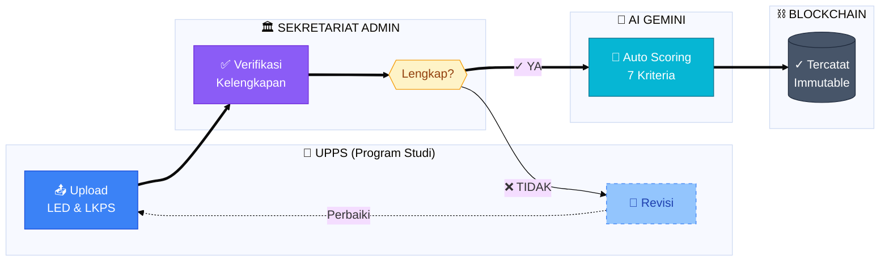
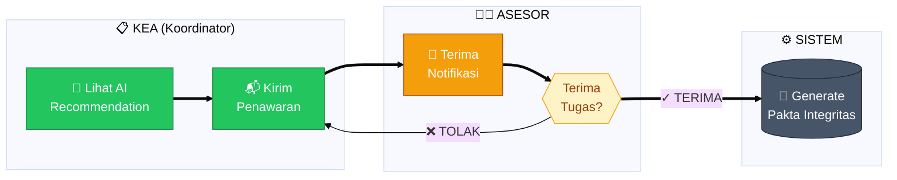
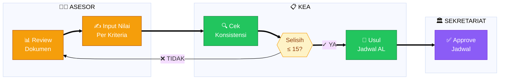
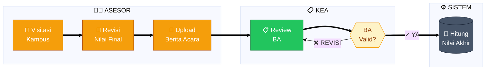
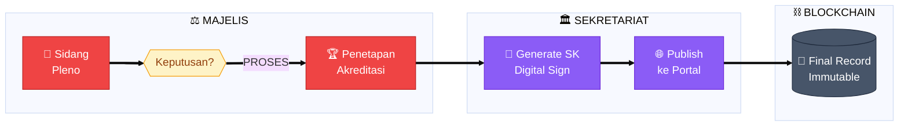

# Mermaid Diagram - Alur Kerja Prototipe LAM-TEK 2025
## Format Swimlane (Cross-Functional Flowchart)

Anda dapat menyalin dan paste ke [mermaid.live](https://mermaid.live) untuk melihat diagramnya.

---

## Diagram Lengkap - Semua Fase (Swimlane Style)

```mermaid
%%{init: {'theme': 'base', 'themeVariables': { 'primaryColor': '#3b82f6', 'primaryTextColor': '#fff', 'primaryBorderColor': '#2563eb', 'lineColor': '#64748b', 'secondaryColor': '#f1f5f9', 'tertiaryColor': '#fff' }}}%%
flowchart TB
    subgraph FASE1["🔵 FASE 1: REGISTRASI & VERIFIKASI"]
        direction LR
        subgraph UPPS1["UPPS"]
            A1["📤 Upload Dokumen<br/>LED & LKPS"]
            A1R["📝 Revisi<br/>Dokumen"]
        end
        subgraph SEK1["SEKRETARIAT"]
            B1["✅ Verifikasi<br/>Admin"]
            B1D{{"Lengkap?"}}
        end
        subgraph AI1["AI GEMINI"]
            C1["🧠 Auto Scoring<br/>Generate Nilai"]
        end
        subgraph SYS1["SISTEM"]
            D1[("Status:<br/>Terverifikasi")]
        end
    end

    subgraph FASE2["🟢 FASE 2: PENUGASAN ASESOR"]
        direction LR
        subgraph KEA2["KEA"]
            E1["🎯 Get AI<br/>Recommendation"]
            E2["📬 Kirim<br/>Penawaran"]
        end
        subgraph ASR2["ASESOR"]
            F1["📩 Terima<br/>Notifikasi"]
            F1D{{"Terima?"}}
        end
        subgraph SYS2["SISTEM"]
            G1[("Generate Pakta<br/>Status: Assigned")]
        end
    end

    subgraph FASE3["🟠 FASE 3: ASESMEN KECUKUPAN"]
        direction LR
        subgraph ASR3["ASESOR"]
            H1["📊 Review &<br/>Scoring Mandiri"]
        end
        subgraph KEA3["KEA"]
            I1["🔍 Validasi AK<br/>Cek Konsistensi"]
            I1D{{"Valid?"}}
            I2["📅 Usul<br/>Jadwal AL"]
        end
        subgraph SEK3["SEKRETARIAT"]
            J1["✅ Approve<br/>Jadwal AL"]
        end
    end

    subgraph FASE4["🔴 FASE 4: ASESMEN LAPANGAN"]
        direction LR
        subgraph ASR4["ASESOR"]
            K1["🏢 Visitasi<br/>Lapangan"]
            K2["📝 Final Score<br/>Revisi Nilai"]
            K3["📄 Upload BA<br/>Berita Acara"]
        end
        subgraph KEA4["KEA"]
            L1["📋 Review<br/>Berita Acara"]
            L1D{{"Signed?"}}
        end
        subgraph SYS4["SISTEM"]
            M1[("Final<br/>Calculation")]
        end
    end

    subgraph FASE5["🟣 FASE 5: KEPUTUSAN & SK"]
        direction LR
        subgraph MAJ5["MAJELIS"]
            N1["👥 Sidang<br/>Pleno"]
            N1D{{"Result?"}}
            N2["🏆 Penetapan<br/>Akreditasi"]
        end
        subgraph SEK5["SEKRETARIAT"]
            O1["📜 Generate SK<br/>Digital Sign"]
            O2["🌐 Publish<br/>& Notifikasi"]
        end
        subgraph SYS5["SISTEM"]
            P1[("Final Record<br/>Blockchain")]
        end
    end

    %% FASE 1 Connections
    A1 --> B1
    B1 --> B1D
    B1D -->|TIDAK| A1R
    A1R -.->|Perbaiki| A1
    B1D -->|YA| C1
    C1 --> D1

    %% FASE 2 Connections
    D1 -.-> E1
    E1 --> E2
    E2 --> F1
    F1 --> F1D
    F1D -->|TOLAK| E2
    F1D -->|TERIMA| G1

    %% FASE 3 Connections
    G1 -.-> H1
    H1 --> I1
    I1 --> I1D
    I1D -->|REVISI| H1
    I1D -->|YA| I2
    I2 --> J1

    %% FASE 4 Connections
    J1 -.-> K1
    K1 --> K2
    K2 --> K3
    K3 --> L1
    L1 --> L1D
    L1D -->|REVISI| L1
    L1D -->|YA| M1

    %% FASE 5 Connections
    M1 -.-> N1
    N1 --> N1D
    N1D -->|PROSES| N2
    N2 --> O1
    O1 --> O2
    O2 --> P1

    %% Styling
    classDef upps fill:#3b82f6,color:#fff,stroke:#2563eb
    classDef sek fill:#8b5cf6,color:#fff,stroke:#7c3aed
    classDef kea fill:#22c55e,color:#fff,stroke:#16a34a
    classDef asesor fill:#f59e0b,color:#fff,stroke:#d97706
    classDef majelis fill:#ef4444,color:#fff,stroke:#dc2626
    classDef ai fill:#06b6d4,color:#fff,stroke:#0891b2
    classDef sistem fill:#475569,color:#fff,stroke:#334155
    classDef decision fill:#fef3c7,color:#92400e,stroke:#f59e0b
    classDef revisi fill:#fee2e2,color:#dc2626,stroke:#ef4444,stroke-dasharray: 5 5

    class A1,A1R upps
    class B1,J1,O1,O2 sek
    class E1,E2,I1,I2,L1 kea
    class F1,H1,K1,K2,K3 asesor
    class N1,N2 majelis
    class C1 ai
    class D1,G1,M1,P1 sistem
    class B1D,F1D,I1D,L1D,N1D decision
```

---

## Fase 1: Registrasi & Verifikasi (Detail)

---

## Fase 2: Penugasan Asesor (Detail)

---

## Fase 3: Asesmen Kecukupan (Detail)

---

## Fase 4: Asesmen Lapangan (Detail)

---

## Fase 5: Keputusan & SK (Detail)

---

## Cara Menggunakan

1. Buka **[mermaid.live](https://mermaid.live)**
2. Copy salah satu kode diagram di atas
3. Paste ke editor Mermaid
4. Diagram akan ter-render otomatis
5. Click **Actions → Export** untuk download sebagai PNG/SVG

### Tips:
- Untuk diagram kompleks, gunakan **Download as PNG** dengan resolusi tinggi
- Untuk presentasi, export sebagai **SVG** agar scalable
- Ubah `theme: 'base'` ke `'dark'` untuk mode gelap
