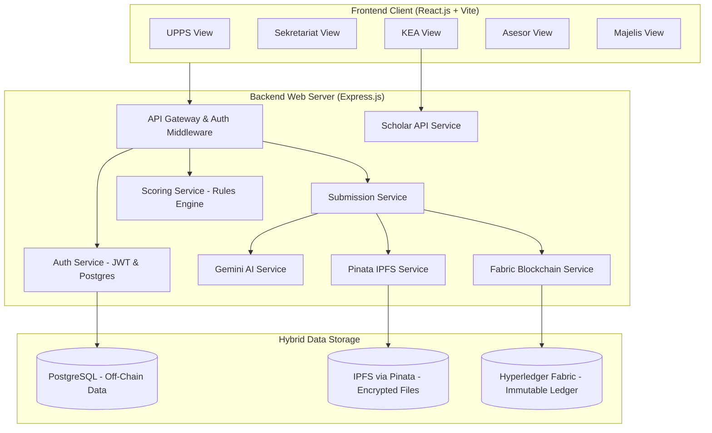
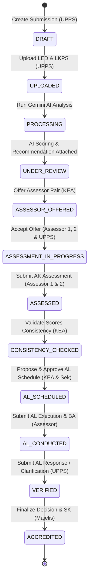

# Product Specification Document (PSD)
## AkreChain: Sistem Akreditasi Berbasis Blockchain dengan Integrasi Artificial Intelligence untuk Automated Assessment (LAM-TEK 2025)

---

## 1. Pendahuluan

### 1.1 Latar Belakang
Proses akreditasi program studi teknik di Indonesia di bawah Lembaga Akreditasi Mandiri Teknik (LAM-TEK) memegang peranan krusial dalam menjamin mutu pendidikan tinggi. Namun, sistem akreditasi konvensional saat ini menghadapi tantangan besar:
*   **Keamanan & Validitas Dokumen:** Kerentanan manipulasi berkas pengajuan (LED-PS dan LKPS) tanpa pencatatan riwayat perubahan (audit trail) yang jelas.
*   **Transparansi & Akuntabilitas:** Terbatasnya visibilitas institusi terhadap tahapan penilaian dan penetapan keputusan.
*   **Beban Administratif:** Proses manual dalam pengunggahan, verifikasi dokumen, dan perhitungan skor yang memakan waktu dan biaya besar.
*   **Inkonsistensi Penilaian:** Potensi perbedaan interpretasi indikator penilaian antar asesor.
*   **Ketidakcocokan Kompetensi Asesor:** Proses pencarian dan penugasan pasangan asesor yang belum optimal dalam mencocokkan keahlian dengan bidang program studi yang dinilai.

AkreChain hadir sebagai solusi inovatif yang mengintegrasikan teknologi **Permissioned Blockchain (Hyperledger Fabric)** dan **Artificial Intelligence (Google Gemini)** untuk menghadirkan platform pendukung keputusan akreditasi yang aman, transparan, objektif, dan efisien.

### 1.2 Tujuan Proyek
1.  **Menjamin Keutuhan Data:** Menggunakan blockchain untuk mencatat sidik jari (SHA-256 hash) dokumen, riwayat audit trail secara permanen (immutable), dan menyimpan berkas terenkripsi di IPFS.
2.  **Meningkatkan Konsistensi Penilaian:** Memanfaatkan Google Gemini AI untuk analisis konten dokumen, pengecekan kelengkapan, dan rekomendasi penilaian awal (*automated scoring*) secara objektif berbasis panduan LAM-TEK 2025.
3.  **Optimalisasi Penugasan Asesor:** Menyediakan fitur *expert matching* berbasis AI untuk merekomendasikan pasangan asesor berdasarkan riwayat publikasi ilmiah mereka (Google Scholar & Semantic Scholar API).
4.  **Otomasi Workflow:** Menyinkronkan proses Asesmen Kecukupan (AK) dan Asesmen Lapangan (AL) menggunakan *smart contract* (chaincode).

### 1.3 Batasan Produk (Scope)
*   **Lingkup Akreditasi:** Dibatasi pada program studi bidang teknik sesuai instrumen penilaian LAM-TEK 2025 yang mencakup 7 kriteria penilaian.
*   **Jenis Dokumen:** Terbatas pada Laporan Evaluasi Diri Program Studi (LED-PS) dalam format PDF dan Laporan Kinerja Program Studi (LKPS) dalam format Excel (.xlsx).
*   **Sifat Sistem:** Berfungsi sebagai *Decision Support System* (DSS). AI dan Blockchain mendukung proses, tetapi hak veto dan keputusan akhir tetap berada di tangan Asesor Manusia dan Majelis Akreditasi.

---

## 2. Peran Pengguna (Stakeholders & Roles)

Sistem AkreChain memiliki 5 peran pengguna utama dengan otoritas yang diatur melalui *Role-Based Access Control* (RBAC) dan MSP (*Membership Service Provider*) pada jaringan blockchain:

| Peran Pengguna | Deskripsi Fungsi | Otoritas Utama |
|:---|:---|:---|
| **UPPS** *(Unit Pengelola Program Studi)* | Representasi program studi/jurusan pengaju akreditasi. | Mengunggah dokumen LED & LKPS, menyetujui/menolak usulan pasangan asesor, mengajukan tanggapan/sanggahan atas hasil Asesmen Lapangan (AL). |
| **Sekretariat** | Unit administratif internal badan akreditasi. | Melakukan verifikasi kelengkapan dokumen administratif, validasi status pembayaran, dan memberikan persetujuan jadwal Asesmen Lapangan (AL). |
| **KEA** *(Ketua Evaluasi Akreditasi)* | Koordinator proses evaluasi dan penjamin konsistensi. | Mengajukan usulan pasangan asesor (Asesor 1 & 2), meninjau kelayakan alasan penolakan asesor oleh UPPS, memverifikasi konsistensi nilai AK antar asesor, dan mengajukan jadwal AL. |
| **Asesor** *(Asesor 1 & Asesor 2)* | Tim pakar indeks independen eksternal penilai kelayakan. | Menerima/menolak tugas penugasan, melakukan penilaian mandiri Asesmen Kecukupan (AK), berpartisipasi dalam kunjungan lapangan, dan mengunggah Berita Acara serta skor final Asesmen Lapangan (AL). |
| **Majelis** *(Majelis Akreditasi)* | Dewan pengambil keputusan tertinggi akreditasi. | Menetapkan status kelayakan akhir akreditasi (peringkat & skor final) dan menerbitkan Surat Keputusan (SK) resmi. |

---

## 3. Arsitektur & Teknologi Sistem

AkreChain dirancang dengan pendekatan arsitektur terdistribusi *Hybrid Storage* untuk menjamin efisiensi penyimpanan dan kepatuhan privasi data.



### 3.1 Spesifikasi Teknologi

*   **Blockchain Platform:** Hyperledger Fabric v2.5.12 (Permissioned Blockchain, TLS dinonaktifkan untuk mempermudah dev lokal, database CouchDB pada peer untuk rich queries).
*   **Smart Contract:** Node.js runtime menggunakan TypeScript & `fabric-contract-api`.
*   **Backend Application:** Node.js Express.js v4.18.2 dengan validasi input Joi, keamanan Helmet, CORS, API Rate Limiting, dan logger tersentralisasi Winston.
*   **Frontend Application:** React.js v18.2.0 + Vite v7.1.7 dengan Tailwind CSS (v4) untuk antarmuka modern yang responsif.
*   **AI Integration:** Google Gemini API (Multimodal LLM) untuk ekstraksi file PDF/Excel dan scoring prediktif.
*   **Distributed File Storage:** IPFS (InterPlanetary File System) yang dikelola melalui API Pinata.
*   **Relational Database:** PostgreSQL untuk penyimpanan relasional off-chain (user profile, audit log lokal, kunci enkripsi).
*   **Encryption Standard:** AES-256-CBC untuk mengenkripsi berkas PDF/Excel sebelum diunggah ke IPFS.

---

## 4. Alur Kerja & Spesifikasi Fungsional (7 Fase Utama)

Proses bisnis AkreChain mengotomatisasi seluruh siklus akreditasi program studi teknik LAM-TEK 2025 melalui tahapan tersinkronisasi sebagai berikut:



### 4.1 Detail Spesifikasi per Fase

#### Fase 1: Manajemen Identitas & Registrasi (MSP CA)
1.  Pengguna melakukan registrasi melalui portal web. Pengguna baru didaftarkan pada server **Fabric Certificate Authority (CA)** sesuai afiliasi organisasinya.
2.  Sertifikat X.509 diterbitkan untuk masing-masing pengguna. Kunci privat disimpan secara aman oleh klien/sistem, sedangkan kunci publik digunakan oleh **Membership Service Provider (MSP)** untuk memvalidasi tanda tangan digital pada setiap transaksi blockchain.

#### Fase 2: Pengajuan Akreditasi (Submission) & Enkripsi Dokumen
1.  UPPS membuat entri pengajuan baru dengan memasukkan data program studi dan tipe program (S, M, D, dll.). Status berubah menjadi `draft`.
2.  UPPS mengunggah dokumen LED-PS (PDF) dan LKPS (Excel).
3.  Backend secara otomatis menghasilkan kunci enkripsi unik **AES-256-CBC** dan Vector Inisialisasi (IV) untuk berkas tersebut.
4.  Berkas yang telah dienkripsi diunggah ke **IPFS** melalui Pinata. Hanya CID (*Content Identifier*) berkas terenkripsi yang dikembalikan.
5.  Kunci dekripsi AES dan IV disimpan di database **PostgreSQL** (off-chain), sedangkan CID IPFS dan hash berkas asli (SHA-256) dicatat pada blockchain melalui transaksi `CreateSubmission`. Status berubah menjadi `uploaded`.

#### Fase 3: Analisis Awal & Penilaian Otomatis oleh AI
1.  Sistem memicu *Scoring Service* dengan mengambil berkas dari IPFS, mendekripsinya menggunakan kunci dari PostgreSQL, dan membaca teksnya (menggunakan `pdf-parse` untuk PDF dan `xlsx` untuk Excel).
2.  Data teks dikirim ke **Google Gemini AI** bersama dengan aturan RAG (*rules.json* berisi matriks penilaian 7 Kriteria LAM-TEK 2025).
3.  AI melakukan:
    *   **Verifikasi Dokumen:** Memastikan berkas PDF adalah benar LED-PS dan berkas Excel adalah benar LKPS.
    *   **Automated Scoring:** Memberikan skor awal (0-4) pada indikator kualitatif dan kuantitatif.
    *   **Completeness Check:** Mengidentifikasi data penting yang hilang dan memberikan catatan rekomendasi perbaikan.
4.  Skor awal dan analisis AI dicatat di blockchain menggunakan fungsi `AttachAIRecommendation`. Status berubah menjadi `processing` lalu `under_review`.

#### Fase 4: Verifikasi Administratif (Sekretariat)
1.  Sekretariat melihat pengajuan berstatus `under_review`.
2.  Sekretariat memverifikasi kelengkapan administrasi fisik dan bukti pembayaran biaya akreditasi.
3.  Setelah disetujui, Sekretariat memvalidasi status dokumen secara on-chain.

#### Fase 5: Penugasan Asesor (*Expert Matching*)
1.  KEA menggunakan modul *Assessor Matching* untuk mencari asesor. Sistem melakukan pencarian *expertise* asesor dengan memanggil **Google Scholar & Semantic Scholar API** untuk menganalisis publikasi ilmiah terakhir mereka dan membandingkannya dengan bidang fokus program studi.
2.  KEA memilih Pasangan Asesor (Asesor 1 & Asesor 2) dan mengajukannya secara on-chain lewat `OfferAssessorPair`. Status pengajuan diset menjadi `assessor_offered`.
3.  **Sistem Persetujuan Tiga Arah:**
    *   Asesor 1 & Asesor 2 harus menyetujui penugasan secara mandiri (mencegah *conflict of interest*).
    *   UPPS juga harus memberikan persetujuan atas pasangan asesor yang diajukan.
    *   Jika salah satu pihak menolak, status kembali ke `under_review` untuk evaluasi KEA (atau KEA dapat melakukan *force assign* jika penolakan UPPS tidak memiliki alasan berdasar).
4.  Setelah disetujui semua pihak, status berubah menjadi `assessment_in_progress`.

#### Fase 6: Asesmen Kecukupan (AK) & Pemeriksaan Konsistensi
1.  Asesor 1 dan Asesor 2 secara independen mengevaluasi dokumen LED & LKPS secara daring.
2.  Masing-masing asesor mengunggah skor instrumen mereka secara on-chain (`SubmitAKAssessment`).
3.  Setelah kedua nilai masuk, KEA menjalankan audit konsistensi (`CheckAKConsistency`):
    *   Sistem membandingkan skor antar asesor per kriteria.
    *   Jika selisih skor masih dalam ambang batas toleransi (misalnya selisih skor total < 0.5), maka pengajuan dinilai *consistent*. Status diubah menjadi `consistency_checked`.
    *   Jika tidak konsisten, KEA menugaskan rapat penyelarasan secara internal.

#### Fase 7: Asesmen Lapangan (AL) & Keputusan Akhir
1.  **Sinkronisasi Alur:** Smart contract memvalidasi kesiapan AL (`CheckFlowsSynchronized`) jika Flow A (AK konsisten) dan Flow B (Jadwal AL disetujui) keduanya terpenuhi.
2.  KEA mengajukan jadwal visitasi lapangan, yang disetujui oleh Sekretariat secara on-chain. Status diubah menjadi `al_scheduled`.
3.  Asesor melakukan visitasi lapangan. Setelah selesai, Asesor mengunggah Laporan Hasil Asesmen Lapangan, skor akhir AL, dan berkas Berita Acara (BA) hasil visitasi ke IPFS. Data di-submit ke blockchain via `SubmitALExecution`. Status berubah ke `al_conducted`.
4.  UPPS diberikan hak unggah tanggapan atas BA tersebut lewat `SubmitALResponse`. Status berubah ke `verified`.
5.  Majelis meninjau laporan final, menetapkan peringkat kelayakan akreditasi (**Unggul / Baik Sekali / Baik / Tidak Terakreditasi**) beserta Nomor SK Akreditasi secara permanen di blockchain melalui transaksi `SetDecision`. Status akhir diubah menjadi `accredited`.

---

## 5. Spesifikasi Smart Contract (Chaincode)

Smart contract AkreChain dikembangkan menggunakan TypeScript pada platform Hyperledger Fabric. Berikut adalah pemetaan metode yang diimplementasikan:

### 5.1 Daftar Fungsi Kontrak (`submission-contract.ts`)

| Kategori | Nama Fungsi | Hak Akses (MSP) | Parameter Masukan | Deskripsi |
|:---|:---|:---|:---|:---|
| **Submission** | `CreateSubmission` | UPPS | `id`, `prodi`, `institusi`, `progType` | Menginisialisasi dokumen pengajuan baru di ledger. |
| | `UpdateDocuments` | UPPS | `id`, `docsJson` | Mengunggah versi dokumen baru (update metadata dan CID). |
| | `QuerySubmission` | All | `id` | Mengambil data pengajuan tertentu dari state. |
| | `QueryAllSubmissions`| All | - | Mengambil semua dokumen pengajuan (CouchDB pagination). |
| | `GetSubmissionHistory`| All | `id` | Mengembalikan jejak audit transaksi historis pengajuan. |
| **AI Integration**| `AttachAIRecommendation`| System / Sek | `id`, `aiJson` | Mencatat hasil skor awal dan validasi dokumen oleh AI. |
| | `SetScoringResult` | System / Sek | `id`, `scoringJson` | Mencatat detail matriks skor awal AI (53/60 butir). |
| **Assessor** | `OfferAssessorPair`| KEA | `id`, `offerId`, `as1`, `as2`| Mengajukan pasangan asesor baru ke program studi. |
| | `RespondToOffer` | Asesor | `id`, `offerId`, `response`, `notes` | Tanggapan asesor (setuju/tolak) atas penawaran tugas. |
| | `UPPSRespondToOffer`| UPPS | `id`, `offerId`, `response`, `notes` | Tanggapan UPPS (setuju/tolak) atas pasangan asesor. |
| **Assessment** | `SubmitAKAssessment`| Asesor | `id`, `assessorId`, `scoresJson` | Menyimpan nilai Asesmen Kecukupan (AK) dari asesor. |
| | `CheckAKConsistency`| KEA | `id`, `consistent`, `notes` | Memverifikasi konsistensi penilaian antar dua asesor. |
| | `ProposeALSchedule`| KEA | `id`, `scheduleId`, `date`, `venue` | Mengajukan rencana jadwal kunjungan lapangan. |
| | `ApproveALSchedule`| Sekretariat | `id`, `scheduleId`, `approved`, `notes` | Persetujuan rencana jadwal visitasi lapangan. |
| | `SubmitALExecution` | Asesor | `id`, `execId`, `baCid`, `scoresJson` | Menyimpan skor final Asesmen Lapangan dan Berita Acara. |
| | `SubmitALResponse` | UPPS | `id`, `respId`, `baResponse`, `notes` | Menyimpan respon/sanggahan dari pihak UPPS atas AL. |
| **Decision** | `SetDecision` | Majelis | `id`, `decisionId`, `rank`, `skNo` | Menetapkan peringkat akreditasi & nomor SK secara final. |

### 5.2 Alur Logika State Transition Status
Status pengajuan akreditasi dikontrol secara ketat oleh logika smart contract:

```
[DRAFT] ─(UpdateDocuments)─> [UPLOADED] ─(AttachAIRecommendation)─> [PROCESSING] -> [UNDER_REVIEW]
                                                                                          │
[ASSESSMENT_IN_PROGRESS] <─(Semua Respond: accept)─ [ASSESSOR_OFFERED] <─(OfferAssessorPair)─┘
           │
     (SubmitAKAssessment x2)
           │
           ▼
      [ASSESSED] ─(CheckAKConsistency)─> [CONSISTENCY_CHECKED] ─(Propose&Approve AL)─> [AL_SCHEDULED]
                                                                                             │
                                                                                    (SubmitALExecution)
                                                                                             │
                                                                                             ▼
[ACCREDITED] <──(SetDecision)── [VERIFIED] <──(SubmitALResponse / Timeout)── [AL_CONDUCTED]
```

---

## 6. Model Data & Skema Database

AkreChain menerapkan skema penyimpanan data yang sinkron antara data relasional (off-chain PostgreSQL) dan data transaksional yang tidak dapat diubah (on-chain Hyperledger Fabric).

### 6.1 Struktur Data On-Chain (Fabric State Ledger)
Setiap objek pengajuan akreditasi disimpan sebagai JSON State pada World State CouchDB dengan skema utama:

```typescript
interface Submission {
    submissionId: string;
    programStudi: string;
    institusi: string;
    programType: 'S' | 'M' | 'D' | 'D1' | 'D2' | 'D3' | 'STr' | 'MTr' | 'DTr' | 'PPI';
    documents: {
        type: 'LED' | 'LKPS';
        cid: string;        // IPFS Content Identifier
        hash: string;       // SHA-256 berkas asli
        filename: string;
        verified: boolean;
        encrypted: boolean;
    }[];
    status: 'draft' | 'uploaded' | 'processing' | 'under_review' | 'assessor_offered' | 
            'assessment_in_progress' | 'assessed' | 'consistency_checked' | 
            'al_scheduled' | 'al_conducted' | 'verified' | 'accredited';
    version: number;
    ai?: {
        scoreCompleteness: number;
        readyForScoring: boolean;
        flags: string[];
        recommendations: string[];
        scoring_summary?: {
            total_score: number;
            max_possible_score: number;
            overall_percentage: number;
            results: {
                indicator_number: string;
                indicator_name: string;
                score: number;
                method: string;
            }[];
        };
    };
    currentOffer?: {
        offerId: string;
        assessor1Id: string;
        assessor2Id: string;
        assessor1Response?: 'pending' | 'accepted' | 'rejected';
        assessor2Response?: 'pending' | 'accepted' | 'rejected';
        uppsResponse?: 'pending' | 'accepted' | 'rejected';
        status: 'pending' | 'completed' | 'rejected';
    };
    assignedAssessors?: {
        assessor1Id: string;
        assessor2Id: string;
        assignedAt: string;
    };
    akAssessments?: {
        assessorId: string;
        scores: { [key: string]: number };
        totalScore: number;
    }[];
    akConsistent?: boolean;
    alSchedule?: {
        scheduleId: string;
        proposedDate: string;
        proposedVenue: string;
        status: 'proposed' | 'approved' | 'rejected';
    };
    alExecution?: {
        executionId: string;
        beritaAcaraCid: string;
        totalScore: number;
        scores: { [key: string]: number };
    };
    alResponse?: {
        responseId: string;
        status: 'submitted' | 'accepted';
        notes: string;
    };
    accreditationDecision?: {
        decisionId: string;
        finalRank: 'Unggul' | 'Baik Sekali' | 'Baik' | 'Tidak Terakreditasi';
        finalScore: number;
        skNumber: string;
        validUntil: string;
    };
    createdAt: string;
    updatedAt: string;
}
```

### 6.2 Skema Database Off-Chain (PostgreSQL)
Database relasional PostgreSQL digunakan untuk menyimpan data struktural aplikasi web:

1.  **`users`**: Informasi akun pengguna, alamat email, hashed password (bcrypt), role, dan sertifikat MSP yang diasosiasikan.
2.  **`assessor_profiles`**: Data CV, URL Google Scholar/Scopus, h-index, jumlah publikasi, dan array keahlian penelitian asesor untuk *expert matching*.
3.  **`encryption_keys`**: Menyimpan kunci enkripsi AES-256 dan IV untuk masing-masing dokumen submission (`submission_id`, `document_type`, `encryption_key`, `encryption_iv`, `cid`).
4.  **`audit_logs`**: Log aktivitas pengguna untuk verifikasi kepatuhan sistem.
5.  **`notifications`**: Sistem notifikasi real-time WebSocket.

---

## 7. Sistem Penilaian (Scoring System) & Formula

AkreChain mengimplementasikan mesin penilaian (*Scoring Engine*) yang sepenuhnya mematuhi pedoman instrumen **LAM-TEK 2025** dengan pembagian 7 Kriteria Mutu.

### 7.1 Distribusi Butir Penilaian Berdasarkan Tipe Program
Sistem menyesuaikan jumlah butir indikator penilaian berdasarkan jenjang program studi:
*   **Sarjana (S):** 60 butir penilaian
*   **Magister (M):** 55 butir penilaian
*   **Doktor (D):** 53 butir penilaian
*   **Diploma (D1, D2, D3):** 56 butir penilaian
*   **Sarjana Terapan (STr):** 64 butir penilaian
*   **Magister Terapan (MTr):** 58 butir penilaian
*   **Doktor Terapan (DTr):** 56 butir penilaian
*   **Profesi Insinyur (PPI):** 54 butir penilaian

### 7.2 Formula Interpolasi 3 Dimensi (3D)
Untuk indikator kerja sama, publikasi ilmiah, dan paten yang memiliki beberapa variabel pembanding, sistem menerapkan rumus interpolasi 3D resmi LAM-TEK:

$$\text{Skor} = 3.75 \times \left( \left(A + B + \frac{C}{2}\right) - (A \times B) - \frac{A \times C}{2} - \frac{B \times C}{2} + \frac{A \times B \times C}{2} \right)$$

Di mana variabel $A, B,$ dan $C$ merepresentasikan nilai rasio pencapaian program studi terhadap ambang batas standar (di-cap maksimal bernilai $1.0$):
*   $A = \min\left(1.0, \frac{\text{Realisasi } A}{\text{Standar } A}\right)$
*   $B = \min\left(1.0, \frac{\text{Realisasi } B}{\text{Standar } B}\right)$
*   $C = \min\left(1.0, \frac{\text{Realisasi } C}{\text{Standar } C}\right)$

### 7.3 Klasifikasi Status Peringkat Akreditasi
Status peringkat akreditasi akhir dikategorikan berdasarkan batas nilai (*threshold*) skor kumulatif (skala 0 - 400):

| Skor Kumulatif | Peringkat Akreditasi | Syarat Tambahan (Syarat Perlu Peringkat) |
|:---|:---|:---|
| **$\ge 361$** | **Unggul** | Skor SPMI $\ge 3.0$, Kualifikasi Dosen (DTPS) $\ge 3.0$ |
| **$301 - 360$** | **Baik Sekali** | Skor SPMI $\ge 2.5$, Kualifikasi Dosen (DTPS) $\ge 2.5$ |
| **$200 - 300$** | **Baik** | Memenuhi seluruh kriteria minimum |
| **$< 200$** | **Tidak Terakreditasi** | Salah satu kriteria mutlak di bawah batas minimum |

---

## 8. Kebutuhan Non-Fungsional (NFR)

### 8.1 Keamanan & Privasi Data
*   **Enkripsi End-to-End:** Semua berkas LED-PS dan LKPS dienkripsi di server backend menggunakan AES-256-CBC sebelum dikirim ke IPFS publik. Kunci enkripsi dilindungi secara ketat di PostgreSQL.
*   **Otorisasi JWT:** Sesi komunikasi REST API dilindungi menggunakan JWT token pendek dengan masa berlaku 15 menit dan refresh token terpisah.
*   **Zero-Knowledge Proof of Integrity:** Penggunaan nilai hash SHA-256 pada blockchain menjamin dokumen yang didekripsi di frontend 100% identik dengan yang diunggah pertama kali.

### 8.2 Performa & Skalabilitas
*   **Penyimpanan Hybrid:** Pemisahan data terstruktur (PostgreSQL), berkas besar terenkripsi (IPFS), dan data konsensus (Hyperledger) menjaga waktu respons API backend di bawah **500 ms** untuk operasi non-blockchain.
*   **Asynchronous AI Processing:** Analisis dokumen oleh Gemini AI dilakukan di background menggunakan sistem queue agar tidak memblokir thread HTTP utama Express.js.

### 8.3 Auditabilitas & Transparansi
*   **Immutable Audit Trail:** Setiap interaksi penting (pergantian versi dokumen, penolakan penugasan asesor, perubahan nilai) dicatat secara permanen di blockchain Fabric dengan stempel waktu (*timestamp*) dan ID organisasi (MSP) penanggung jawab transaksi.

---

## 9. Rencana Uji & Verifikasi (Verification Plan)

### 9.1 Pengujian Otomatis
*   **API Endpoint Testing:** Menjalankan skrip integrasi `test_api.sh` untuk mensimulasikan alur unggah, kalkulasi skor AI, input manual, dan query data submission.
*   **Smart Contract Unit Tests:** Menggunakan framework testing TypeScript untuk melakukan *mocking* MockStub Fabric guna memastikan logika fungsi chaincode mengembalikan error pada hak akses (MSP) yang salah.

### 9.2 Verifikasi Manual
*   **End-to-End Scenario:** Melakukan simulasi multi-aktor dengan meluncurkan 5 browser atau sesi penyamaran terpisah untuk bertindak sebagai UPPS, Sekretariat, KEA, Asesor, dan Majelis, guna memastikan seluruh transisi status berjalan dengan lancar.
