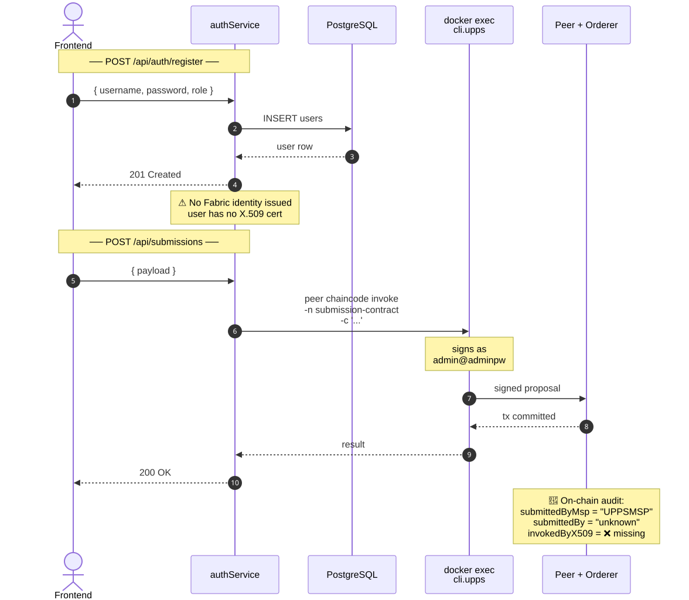
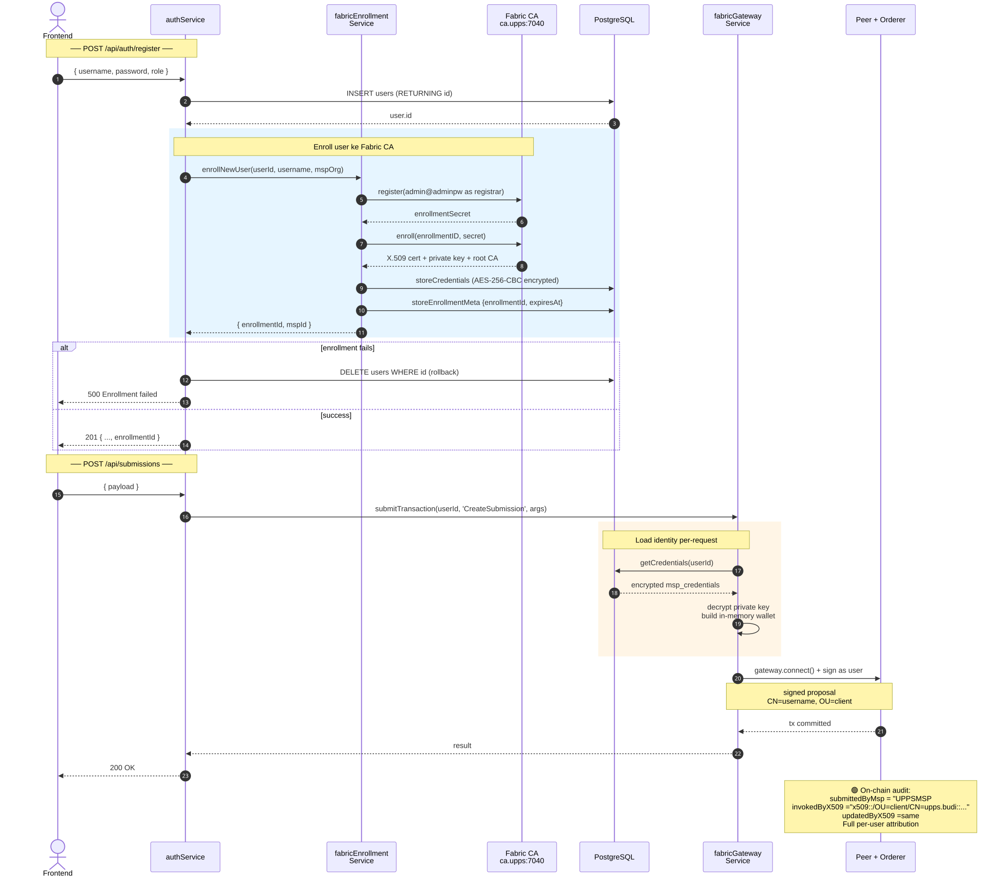

# Per-User MSP Enrollment & Signing — Changelog

**Branch:** `feat/per-user-msp-enrollment`
**Tanggal:** 2026-06-28
**Author:** darwan
**Plan:** [`docs/superpowers/plans/2026-06-28-per-user-msp-enrollment.md`](../plans/2026-06-28-per-user-msp-enrollment.md)

Dokumen ini ngejelasin perubahan arsitektur MSP: dari **org-admin docker-exec signing** ke **per-user Fabric CA enrollment**. Setiap tx sekarang ditandatangani pake identitas user sendiri (bukan admin org), dan X.509 subject DN-nya kesimpen di chain sebagai audit field.

---

## TL;DR

| | Sebelum | Sesudah |
|---|---|---|
| **Signer** | Org admin (`admin@adminpw`) via `docker exec cli.X peer chaincode invoke` | User sendiri, pake X.509 cert dari Fabric CA |
| **Audit on-chain** | Cuma MSP org (e.g. `UPPSMSP`) | MSP org + X.509 subject DN (e.g. `x509::/OU=client/CN=upps.budi::...`) |
| **Identity source** | Hardcoded di `.env` (`FABRIC_USER_ID=admin`) | DB (`users.msp_credentials`, encrypted AES-256-CBC) |
| **Enrollment trigger** | Manual, via Fablo bootstrap | Otomatis pas `authService.register()` |
| **Backend path** | Spawn `docker exec` subprocess per tx | `fabric-network` SDK in-process, in-memory wallet |

---

## Flow Diagrams

Visualisasi alur sebelum vs sesudah. File SVG ada di `docs/assets/per-user-msp-enrollment/`.

### Sebelum — Sequence Diagram



### Sebelum — Flowchart



### Sesudah — Sequence Diagram



### Sesudah — Flowchart



---

## ASCII Flow (Inline Reference)

### Flow Sebelum (Org-Admin Docker-Exec)

```
┌──────────┐   POST /register    ┌──────────────┐
│ Frontend │ ─────────────────▶  │ authService  │
└──────────┘                     │  .register() │
                                 └──────┬───────┘
                                        │ INSERT users
                                        ▼
                                 ┌──────────────┐
                                 │   Database   │
                                 └──────────────┘

              ⋮ NO ENROLLMENT — user has no Fabric identity

┌──────────┐  POST /submissions   ┌──────────────┐    docker exec          ┌────────────────┐
│ Frontend │ ──────────────────▶  │  controller  │ ─────────────────────▶  │  cli.upps...   │
└──────────┘                      │  → fabricSvc │   peer chaincode invoke │  (as admin)    │
                                  └──────────────┘                         └───────┬────────┘
                                                                                    │ signs as
                                                                                    │ admin@adminpw
                                                                                    ▼
                                                                           ┌────────────────┐
                                                                           │  Peer / Orderer│
                                                                           └────────────────┘

Audit on-chain:
  submission.submittedByMsp = "UPPSMSP"
  submission.submittedBy    = "unknown"      ← no user attribution
```

**Masalah:**
- Setiap tx di-sign sebagai admin org → ga ada cryptographic proof siapa yang invoke
- `submittedBy` selalu `"unknown"` di chain → ga bisa audit per user
- Backend harus spawn `docker exec` subprocess per tx → lambat + bound ke mesin yang jalanin peer
- Kalau backend di-compromise, attacker bisa invoke sebagai admin org apapun

---

### Flow Sesudah (Per-User Fabric CA Enrollment)

```
┌──────────┐  POST /register     ┌──────────────┐    1. INSERT users         ┌──────────┐
│ Frontend │ ─────────────────▶  │ authService  │ ──────────────────────▶   │ Database │
└──────────┘                     │  .register() │                            └──────────┘
                                 └──────┬───────┘
                                        │ 2. fabricEnrollmentService.enrollNewUser()
                                        ▼
                                 ┌──────────────┐   register+enroll    ┌─────────────────┐
                                 │ Enrollment   │ ─────────────────▶  │  Fabric CA      │
                                 │  Service     │ ◀─────────────────  │  (ca.upps:7040)  │
                                 └──────┬───────┘   cert + private key └─────────────────┘
                                        │ 3. encrypt (AES-256-CBC) + store
                                        ▼
                                 ┌──────────────┐
                                 │   Database   │   users.msp_credentials (encrypted JSONB)
                                 │              │   users.enrollment_id     (public)
                                 │              │   users.cert_expires_at   (public)
                                 └──────────────┘

                                  ⚠️ If enrollment fails → DELETE users WHERE id (rollback)


┌──────────┐ POST /submissions   ┌──────────────┐  fabricGatewayService     ┌────────────────┐
│ Frontend │ ──────────────────▶ │  controller  │ ───────────────────────▶ │ fabric-network │
└──────────┘                     │ → fabricSvc  │   submitTransaction(     │     SDK        │
                                 │   (facade)   │     userId, ...)         └───────┬────────┘
                                 └──────────────┘                                  │
                                                                                   │ 1. load creds from DB
                                                                                   │ 2. decrypt private key
                                                                                   │ 3. in-memory wallet
                                                                                   │ 4. gateway.connect()
                                                                                   ▼
                                                                           ┌────────────────┐
                                                                           │  Peer / Orderer│
                                                                           └────────────────┘

Audit on-chain:
  submission.submittedByMsp = "UPPSMSP"
  submission.invokedByX509  = "x509::/OU=client/CN=upps.budi::/C=US/.../CN=ca.upps..."
  submission.updatedByX509  = "x509::/OU=client/CN=upps.budi::/C=US/.../CN=ca.upps..."
```

---

## Komponen Utama

### 1. `fabricEnrollmentService.js` (baru)

Register + enroll user ke Fabric CA org masing-masing:

```js
const result = await fabricEnrollmentService.enrollNewUser({
  userId: '43c91f5f-...',
  username: 'upps.budi',
  mspOrg: 'UPPSMSP',   // → ca.upps.akreditasi.local:7040
});
// → { enrollmentId: 'upps.budi', mspId: 'UPPSMSP' }
```

- Pakai bootstrap admin (`admin`/`adminpw`) sebagai registrar
- Username di-sanitize jadi slug kecil (`Foo.Bar` → `foo.bar`)
- CA ports hardcode per org: UPPS=7040, Sekretariat=7060, KEA=7080, Asesor=7100, Majelis=7120
- Admin User di-cache per process (`_adminCache[mspOrg]`)

### 2. `fabricGatewayService.js` (baru)

Wrapper `fabric-network` Gateway, sign tx sebagai user:

```js
const result = await fabricGatewayService.submitTransaction(
  userId,
  'CreateSubmission',
  [submissionId, JSON.stringify(payload)]
);
```

- Wallet in-memory, di-load dari `fabricCredentialService.getCredentials(userId)`
- Connection profile lazy-load + cache per MSP
- `try/finally` pastikan `gateway.disconnect()` walau ada error
- Channel `'akreditasi'` + chaincode `'submission-contract'` hardcode

### 3. `fabricService.js` (refactor, 606 → 186 lines)

Facade tipis di atas `fabricGatewayService`. Signature semua method public sama (`createSubmission`, `setDecision`, etc.) jadi controller ga perluubah. Yang beda: terima `userId` instead of `mspOrg`:

```js
// Sebelum
fabricService.createSubmission(mspOrg, submissionId, payload)

// Sesudah
fabricService.createSubmission(userId, submissionId, payload)
```

### 4. `authService.register()` (modifikasi)

Setelah INSERT user, panggil enrollment. Kalau gagal, rollback:

```js
const user = await query('INSERT INTO users ...');
try {
  const enrollment = await fabricEnrollmentService.enrollNewUser({ ... });
  return { ...user, enrollmentId: enrollment.enrollmentId };
} catch (err) {
  await query('DELETE FROM users WHERE id = $1', [user.id]);
  throw err;
}
```

### 5. Chaincode: `assertMSP()` (modifikasi)

Sekarang return `{ mspId, x509Subject }`:

```ts
private assertMSP(ctx, allowedMsps, fnName) {
  const mspId = ctx.clientIdentity.getMSPID();
  if (!allowedMsps.includes(mspId)) throw new Error(...);
  let x509Subject = 'unknown';
  try { x509Subject = ctx.clientIdentity.getID(); } catch {}
  return { mspId, x509Subject };
}

// Call sites:
const { mspId, x509Subject } = this.assertMSP(ctx, ['UPPSMSP'], 'CreateSubmission');
submission.submittedByMsp = mspId;
submission.invokedByX509  = x509Subject;   // ← baru
submission.updatedByX509  = x509Subject;   // ← baru
```

- 20 call sites di-destructure
- 19 function set `updatedByX509`
- `Submission` interface di `types.ts` dapat field opsional `invokedByX509?` + `updatedByX509?` (backward compatible)

### 6. DB Migration `005-add-enrollment-columns.sql`

```sql
ALTER TABLE users
  ADD COLUMN IF NOT EXISTS enrollment_id     VARCHAR(100),
  ADD COLUMN IF NOT EXISTS enrollment_secret  TEXT,
  ADD COLUMN IF NOT EXISTS cert_expires_at    TIMESTAMP;

CREATE UNIQUE INDEX IF NOT EXISTS idx_users_enrollment_id
  ON users(enrollment_id) WHERE enrollment_id IS NOT NULL;
```

---

## File yang Berubah

| File | Aksi | Ringkas |
|---|---|---|
| `backend-express/src/services/fabricEnrollmentService.js` | **baru** | Fabric CA register+enroll per user |
| `backend-express/src/services/fabricGatewayService.js` | **baru** | fabric-network wrapper untuk per-user signing |
| `backend-express/src/services/fabricCredentialService.js` | modifikasi | Tambah `storeEnrollmentMeta(userId, {...})` |
| `backend-express/src/services/fabricService.js` | rewrite | 606 → 186 lines, jadi facade |
| `backend-express/src/services/authService.js` | modifikasi | `register()` auto-enroll + rollback |
| `backend-express/src/controllers/*.js` | modifikasi | Pass `userId` instead of `mspOrg` |
| `backend-express/src/config/index.js` | modifikasi | Hapus ghost alias `SekretariatAdminMSP` |
| `backend-express/sql/005-add-enrollment-columns.sql` | **baru** | Migration |
| `backend-express/.env.example` + `.env` | modifikasi | Tambah `FABRIC_CA_ADMIN_NAME` + `FABRIC_CA_ADMIN_PASSWORD` |
| `chaincode/submission-contract/src/submission-contract.ts` | modifikasi | `assertMSP` return x509, 20 call sites |
| `chaincode/submission-contract/src/types.ts` | modifikasi | `invokedByX509?` + `updatedByX509?` |
| `backend-express/scripts/smoke-test-signing.js` | **baru** | E2E smoke test |

---

## Verifikasi End-to-End

Chaincode di-upgrade ke **v1.1** (sequence 3). Smoke test di `backend-express/scripts/smoke-test-signing.js` melakukan:

1. Load user `smoke.test3` dari DB
2. Submit `CreateSubmission` via `fabricGatewayService.submitTransaction(userId, ...)`
3. Query balik + assert X.509 audit field

Output yang didapat:

```
invokedByX509: x509::/OU=client/CN=smoke.test3::/C=US/ST=California/L=San Francisco/O=upps.akreditasi.local/CN=ca.upps.akreditasi.local
updatedByX509: x509::/OU=client/CN=smoke.test3::/C=US/ST=California/L=San Francisco/O=upps.akreditasi.local/CN=ca.upps.akreditasi.local
submittedByMsp: UPPSMSP

✅ SMOKE TEST PASSED: per-user X.509 audit field recorded on-chain
```

Cara jalanin:

```bash
cd backend-express
node scripts/smoke-test-signing.js
```

---

## Known Limitations / Follow-ups

Hal-hal yang di-flag code reviewer tapi bukan blocker untuk dev merge:

- **Admin key cache lifetime** — `_adminCache[mspOrg]` di `fabricEnrollmentService.js:36` nahan private key admin in-memory sampai process mati. Acceptable untuk single-tenant dev backend, tapi perlu threat-model review sebelum production.
- **Hard `DELETE` saat rollback** — `authService.js:69` delete user row kalau enrollment gagal. Kalau ada FK `ON DELETE RESTRICT` (e.g. `audit_logs`), rollback bisa throw & mask error asli. Pertimbangin soft-delete `UPDATE users SET is_active = FALSE`.
- **Slug collision** — `username.toLowerCase().replace(/[^a-z0-9.-]/g, '-')` bikin `Foo.Bar` dan `foo_bar` jadi slug sama (`foo.bar`). DB unique index nolak duplikat tapi error message-nya opaque. Pre-check sebelum enroll.
- **Sync `fs.readFileSync` di request path** — `fabricGatewayService.js:44` load connection profile pertama kali per MSP. Lazy + cached, tapi first hit blocks event loop.
- **Magic strings** — Channel `'akreditasi'` + chaincode `'submission-contract'` hardcode di `fabricGatewayService.js`. `config/index.js` udah expose `channelName` + `chaincodeName`, tinggal wire through.

---

## Cara Replay dari Nol

Kalau mau setup fresh:

```bash
# 1. Pastikan Fabric network jalan
cd /Users/darwan/project/batap
fablo up   # atau: cd fablo-target && ./fabric-docker.sh up

# 2. Apply migration
docker exec -i postgres-akreditasi psql -U lamtek -d akreditasi \
  < backend-express/sql/005-add-enrollment-columns.sql

# 3. Upgrade chaincode ke v1.1 (sequence 3)
cd fablo-target
./fabric-docker.sh chaincode upgrade submission-contract 1.1

# 4. Restart backend
cd ../backend-express
npm start

# 5. Register user baru (auto-enroll)
curl -X POST http://localhost:8000/api/auth/register \
  -H 'Content-Type: application/json' \
  -d '{ "username": "test.upps", "password": "...", "role": "upps", ... }'

# 6. Smoke test
node scripts/smoke-test-signing.js
```

